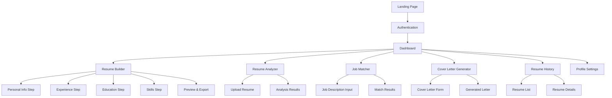
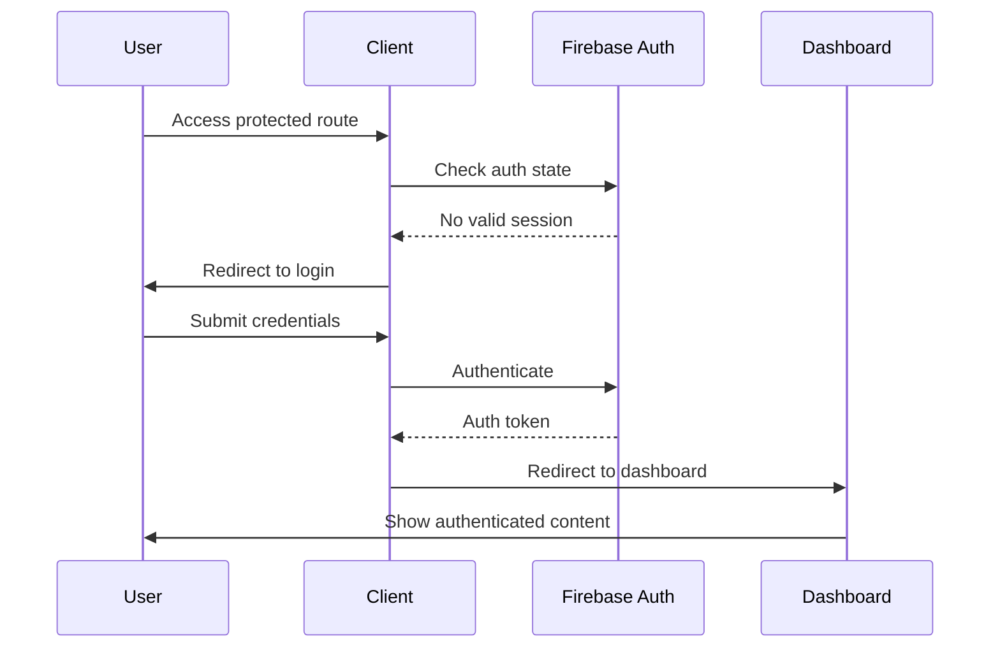

# Design Document: HireLens AI

## 1. Product Vision

### Problem Statement

Job seekers struggle with creating effective resumes that pass Applicant Tracking Systems (ATS) and match job requirements. Traditional resume builders lack intelligence to analyze content quality, keyword optimization, and job-specific customization. Users often submit resumes without understanding their ATS compatibility or how well they align with specific job descriptions, leading to missed opportunities and ineffective applications.

### Target Users

**Primary Users:**
- **Students & New Graduates**: Need guidance creating their first professional resumes with limited experience
- **Active Job Seekers**: Professionals actively applying to multiple positions requiring tailored resumes
- **Career Changers**: Individuals transitioning between industries needing to reposition their experience

**Secondary Users:**
- **Passive Job Seekers**: Employed professionals maintaining updated resumes for future opportunities
- **Freelancers & Consultants**: Need multiple resume versions for different client types and project scopes

### Core Value Proposition

Transform resume creation from a manual, guesswork process into an intelligent, data-driven experience that maximizes job application success through AI-powered analysis, optimization, and personalization.

**Key Differentiators:**
- Real-time ATS compatibility scoring with specific improvement recommendations
- Job description matching with keyword gap analysis and priority suggestions
- AI-generated content that maintains authenticity while optimizing for impact
- Comprehensive analytics showing resume performance across different job types

## 2. Information Architecture

### Complete Page List



### Navigation Structure

**Primary Navigation (Sidebar):**
- Dashboard (Home icon)
- Resume Builder (Edit icon)
- Resume Analyzer (Search icon)
- Job Matcher (Target icon)
- Cover Letter Generator (Mail icon)
- Resume History (Clock icon)
- Profile Settings (User icon)

**Secondary Navigation:**
- User menu (Avatar dropdown): Profile, Settings, Logout
- Breadcrumbs for multi-step processes
- Progress indicators for forms and analysis

### Authentication Flow



### User Journey Flow

**New User Onboarding:**
1. Landing page → Sign up → Email verification → Dashboard
2. Welcome tour highlighting key features
3. Guided resume creation with AI assistance
4. First analysis to demonstrate value

**Returning User Flow:**
1. Login → Dashboard → Recent activity summary
2. Quick access to last edited resume
3. Notifications for analysis improvements
4. One-click resume updates and exports

## 3. Detailed Page Wireframe Descriptions

### Landing Page

**Layout Structure:**
- Fixed header with logo, navigation menu, and CTA buttons
- Hero section with value proposition and demo video/animation
- Feature showcase with three-column grid
- Social proof section with testimonials and statistics
- Pricing tiers (if applicable) with feature comparison
- Footer with links, contact info, and legal pages

**Key Sections:**
- **Hero**: "Create ATS-Optimized Resumes with AI Intelligence"
- **Features**: Resume Builder, ATS Analyzer, Job Matcher cards
- **Social Proof**: User testimonials, success statistics, company logos
- **CTA**: "Start Building Your Resume" and "Analyze Existing Resume"

**User Interactions:**
- Scroll-triggered animations for feature reveals
- Interactive demo showing ATS score improvement
- Hover effects on feature cards with expanded descriptions
- Sticky header with smooth scroll navigation

**States:**
- **Loading**: Skeleton placeholders for content sections
- **Error**: Fallback content if dynamic elements fail to load
- **Mobile**: Collapsed navigation, stacked layout, touch-optimized CTAs

### Login / Signup Pages

**Layout Structure:**
- Centered card design with form fields
- Left panel with branding and value proposition (desktop)
- Social login options (Google, LinkedIn)
- Form validation with real-time feedback
- Password strength indicator for signup

**Components:**
- Email/password input fields with validation states
- "Remember me" checkbox for login
- "Forgot password" link with modal flow
- Terms of service and privacy policy checkboxes
- Loading spinner overlay during authentication

**User Interactions:**
- Tab switching between login and signup
- Real-time validation with success/error indicators
- Password visibility toggle
- Auto-focus progression through form fields

**States:**
- **Empty**: Clean form with placeholder text
- **Validation**: Field-level error messages with red borders
- **Loading**: Disabled form with spinner overlay
- **Success**: Brief confirmation before redirect
- **Error**: Alert banner with retry options

### Dashboard

**Layout Structure:**
- Header with user avatar, notifications, and quick actions
- Main content area with widget grid (2x3 on desktop, stacked on mobile)
- Sidebar navigation with active state indicators
- Quick stats cards showing resume count, analysis scores, recent activity

**Key Widgets:**
- **Recent Resumes**: Thumbnail previews with edit/analyze buttons
- **ATS Score Summary**: Average score with trend indicator
- **Quick Actions**: "New Resume", "Analyze Resume", "Generate Cover Letter"
- **Activity Feed**: Recent analyses, matches, and improvements
- **Tips & Insights**: Personalized recommendations based on user data

**User Interactions:**
- Drag-and-drop widget reordering (future enhancement)
- Expandable widgets for detailed views
- Quick action buttons with hover tooltips
- Filter and sort options for activity feed

**States:**
- **Empty**: Welcome message with onboarding prompts for new users
- **Loading**: Skeleton placeholders for all widgets
- **Error**: Individual widget error states with retry buttons
- **No Data**: Helpful prompts to create first resume or run first analysis

### Resume Builder Page

**Layout Structure:**
- Multi-step wizard with progress indicator
- Left panel: Form sections with collapsible categories
- Right panel: Live preview with template selection
- Bottom toolbar: Save, AI Generate, Preview, Export buttons

**Form Sections:**
1. **Personal Information**: Name, contact details, professional summary
2. **Work Experience**: Company, role, dates, AI-generated bullet points
3. **Education**: Degree, institution, dates, relevant coursework
4. **Skills**: Technical and soft skills with proficiency levels
5. **Additional**: Certifications, projects, languages, volunteer work

**AI Integration Points:**
- **Professional Summary**: Generate based on experience and target role
- **Bullet Points**: Transform basic descriptions into impact-focused statements
- **Skills Suggestions**: Recommend relevant skills based on experience
- **Content Optimization**: Real-time ATS score as user types

**User Interactions:**
- Step-by-step navigation with validation
- AI content generation with accept/reject/edit options
- Template switching with instant preview updates
- Auto-save with visual confirmation
- Keyboard shortcuts for power users

**States:**
- **Form Validation**: Real-time field validation with helpful error messages
- **AI Loading**: Spinner with progress text ("Analyzing your experience...")
- **AI Success**: Smooth animation revealing generated content
- **AI Error**: Fallback with manual input option and retry button
- **Save States**: Auto-save indicator, manual save confirmation, error recovery

### Resume Analyzer Page

**Layout Structure:**
- Upload area with drag-and-drop and file browser options
- Job description input with paste and file upload options
- Analysis results dashboard with score visualization
- Detailed recommendations with priority ranking

**Upload Component:**
- **File Types**: PDF, DOC, DOCX, TXT with clear format indicators
- **Size Limits**: 5MB maximum with progress bar during upload
- **Preview**: Text extraction preview before analysis
- **Error Handling**: Format validation, size checking, corruption detection

**Analysis Results:**
- **ATS Score**: Large circular progress indicator (0-100)
- **Score Breakdown**: Categories like formatting, keywords, content structure
- **Keyword Analysis**: Missing keywords with importance ratings
- **Recommendations**: Prioritized list with before/after examples
- **Comparison View**: Side-by-side resume vs job description highlighting

**User Interactions:**
- File drag-and-drop with visual feedback
- Job description paste with automatic formatting cleanup
- Interactive score breakdown with drill-down details
- One-click keyword insertion into resume
- Export analysis report as PDF

**States:**
- **Empty**: Upload prompts with example files and instructions
- **Uploading**: Progress bar with file processing status
- **Processing**: AI analysis progress with estimated time remaining
- **Results**: Comprehensive dashboard with actionable insights
- **Error**: Clear error messages with troubleshooting steps

### Job Matcher Page

**Layout Structure:**
- Resume selection dropdown (from saved resumes)
- Job description input area with URL import option
- Match results with percentage and detailed breakdown
- Gap analysis with improvement suggestions
- Keyword mapping visualization

**Match Visualization:**
- **Overall Match**: Percentage with color-coded indicator (red <50%, yellow 50-75%, green >75%)
- **Category Breakdown**: Skills, experience, education match percentages
- **Keyword Heatmap**: Visual representation of keyword density and matches
- **Gap Analysis**: Missing requirements with priority levels
- **Strength Highlights**: Areas where resume exceeds requirements

**User Interactions:**
- Resume selection with preview thumbnail
- Job URL import with automatic text extraction
- Interactive match breakdown with expandable sections
- Keyword highlighting in both resume and job description
- Export match report with improvement roadmap

**States:**
- **Setup**: Resume and job description input with validation
- **Processing**: Match analysis with progress indicator
- **Results**: Comprehensive match dashboard with insights
- **No Match**: Guidance for significant mismatches
- **Error**: Fallback options and retry mechanisms

### Cover Letter Generator Page

**Layout Structure:**
- Input section: Resume selection and job description
- Customization options: Tone, length, focus areas
- Generated letter display with editing capabilities
- Export options with multiple formats

**Customization Controls:**
- **Tone Selection**: Professional, Enthusiastic, Conservative, Creative
- **Length Options**: Brief (200-300 words), Standard (300-400 words), Detailed (400-500 words)
- **Focus Areas**: Checkboxes for skills, experience, cultural fit, growth potential
- **Company Research**: Optional field for company-specific information

**Generated Content:**
- **Structure**: Introduction, 2-3 body paragraphs, conclusion
- **Personalization**: Company name, role title, specific requirements addressed
- **Editing Tools**: Inline editing with AI suggestions for improvements
- **Version History**: Save multiple versions with comparison view

**User Interactions:**
- Real-time preview as customization options change
- Inline editing with AI-powered suggestions
- Copy to clipboard and direct export options
- Template saving for future use

**States:**
- **Input**: Form validation and requirement checking
- **Generating**: AI processing with creative writing indicators
- **Generated**: Editable letter with formatting options
- **Customizing**: Real-time updates as user makes changes
- **Error**: Fallback templates and manual editing options

### Resume History Page

**Layout Structure:**
- Grid view of resume cards with thumbnails and metadata
- Filter and search controls in header
- Bulk actions toolbar for selected resumes
- Detailed view modal for individual resumes

**Resume Cards:**
- **Thumbnail**: Visual preview of resume layout
- **Metadata**: Title, last modified date, ATS score, job matches
- **Quick Actions**: Edit, Analyze, Duplicate, Delete, Export
- **Status Indicators**: Draft, Complete, Analyzed, Matched

**Filter Options:**
- **Date Range**: Last week, month, year, custom range
- **ATS Score**: Score ranges with slider control
- **Status**: Draft, complete, analyzed
- **Template**: Filter by resume template used

**User Interactions:**
- Grid/list view toggle with user preference saving
- Multi-select with bulk operations
- Sort by date, score, name, or usage frequency
- Search by resume title or content keywords

**States:**
- **Empty**: Onboarding message with "Create First Resume" CTA
- **Loading**: Skeleton cards while fetching data
- **Filtered**: Clear active filters with result count
- **Selected**: Bulk action toolbar with operation options
- **Error**: Retry mechanism with offline indicator

### Profile Settings Page

**Layout Structure:**
- Tabbed interface: Account, Preferences, Billing, Privacy
- Form sections with clear grouping and validation
- Save/cancel actions with change detection
- Danger zone for account deletion

**Account Tab:**
- **Personal Info**: Name, email, phone with verification status
- **Password Change**: Current/new password with strength indicator
- **Profile Picture**: Upload with crop tool and preview
- **Account Status**: Subscription level and usage statistics

**Preferences Tab:**
- **AI Settings**: Default tone, creativity level, content preferences
- **Notifications**: Email preferences, in-app notifications, frequency
- **Interface**: Theme selection, language, accessibility options
- **Export Defaults**: Preferred formats, template selection

**User Interactions:**
- Real-time validation with success/error feedback
- Change detection with unsaved changes warning
- Preview changes before saving
- Bulk preference updates with confirmation

**States:**
- **Viewing**: Read-only display with edit buttons
- **Editing**: Form mode with validation and save options
- **Saving**: Loading state with progress indication
- **Saved**: Confirmation message with auto-dismiss
- **Error**: Field-level errors with correction guidance

## 4. Component Breakdown

### Navigation Components

**Navbar**
- Logo with home link
- Primary navigation menu with active states
- User avatar dropdown with profile options
- Notification bell with badge count
- Mobile hamburger menu with slide-out drawer

**Sidebar**
- Collapsible navigation with icons and labels
- Active page highlighting with accent color
- Nested menu items for multi-level navigation
- Quick action buttons for common tasks
- Responsive behavior: full on desktop, icons-only on tablet, hidden on mobile

### Form Components

**Resume Form Sections**
- **Personal Info Section**: Contact details with validation patterns
- **Experience Section**: Dynamic list with add/remove functionality
- **Education Section**: Degree selection with auto-complete
- **Skills Section**: Tag input with suggestions and categories
- **AI Content Generator**: Modal with prompt input and result display

**Input Components**
- **Text Input**: Standard input with label, placeholder, validation states
- **Textarea**: Auto-expanding text area with character count
- **Select Dropdown**: Searchable dropdown with custom options
- **Date Picker**: Calendar widget with range selection
- **File Upload**: Drag-and-drop area with progress indication

### Analysis Components

**ATS Score Card**
- Circular progress indicator with animated score reveal
- Color-coded scoring: Red (0-49), Yellow (50-74), Green (75-100)
- Breakdown sections with individual category scores
- Improvement suggestions with priority indicators
- Historical score tracking with trend visualization

**Progress Bars**
- Linear progress for file uploads and processing
- Segmented progress for multi-step forms
- Circular progress for loading states
- Animated progress with smooth transitions
- Custom styling to match brand colors

**Suggestion Cards**
- Priority level indicators (High, Medium, Low)
- Before/after content examples
- One-click apply functionality
- Dismissible with feedback collection
- Category grouping with expandable sections

### Modal Components

**Modal Dialogs**
- Confirmation modals for destructive actions
- Form modals for quick data entry
- Preview modals for resume and cover letter viewing
- Help modals with contextual guidance
- Loading modals with progress indication

**File Upload Component**
- Drag-and-drop zone with visual feedback
- File type validation with clear error messages
- Upload progress with cancel option
- Multiple file selection with batch processing
- Preview functionality for supported formats

### Display Components

**Template Preview Card**
- Thumbnail image with hover zoom effect
- Template name and description
- Usage statistics and popularity indicators
- Quick preview modal with full-size view
- Selection state with checkmark overlay

**Keyword Highlight Component**
- Text highlighting with different colors for match types
- Tooltip display with keyword importance
- Interactive highlighting with click-to-focus
- Export functionality for highlighted content
- Search and filter within highlighted text

### Feedback Components

**Toast Notifications**
- Success messages with green accent and checkmark icon
- Error messages with red accent and warning icon
- Info messages with blue accent and info icon
- Auto-dismiss with manual close option
- Stacking behavior for multiple notifications

**Loading States**
- Skeleton placeholders matching content structure
- Spinner overlays for form submissions
- Progress indicators for long-running operations
- Animated placeholders with shimmer effect
- Contextual loading messages

## 5. UI Design System

### Color Palette

**Primary Colors:**
- Primary Blue: `#2563eb` (Interactive elements, CTAs)
- Primary Dark: `#1d4ed8` (Hover states, active elements)
- Primary Light: `#dbeafe` (Backgrounds, subtle accents)

**Secondary Colors:**
- Success Green: `#10b981` (Success states, positive scores)
- Warning Yellow: `#f59e0b` (Warnings, medium scores)
- Error Red: `#ef4444` (Errors, low scores)
- Info Blue: `#06b6d4` (Information, neutral states)

**Neutral Colors:**
- Gray 900: `#111827` (Primary text, headings)
- Gray 700: `#374151` (Secondary text, labels)
- Gray 500: `#6b7280` (Placeholder text, disabled states)
- Gray 300: `#d1d5db` (Borders, dividers)
- Gray 100: `#f3f4f6` (Background, subtle sections)
- Gray 50: `#f9fafb` (Page background, cards)

**Dark Mode Palette:**
- Dark Background: `#0f172a` (Main background)
- Dark Surface: `#1e293b` (Card backgrounds)
- Dark Border: `#334155` (Borders, dividers)
- Dark Text Primary: `#f1f5f9` (Primary text)
- Dark Text Secondary: `#cbd5e1` (Secondary text)

### Typography Scale

**Font Family:**
- Primary: `Inter, -apple-system, BlinkMacSystemFont, 'Segoe UI', sans-serif`
- Monospace: `'JetBrains Mono', 'Fira Code', Consolas, monospace`

**Font Sizes:**
- xs: `12px` (Captions, small labels)
- sm: `14px` (Body text, form inputs)
- base: `16px` (Default body text)
- lg: `18px` (Large body text, subheadings)
- xl: `20px` (Section headings)
- 2xl: `24px` (Page headings)
- 3xl: `30px` (Hero headings)
- 4xl: `36px` (Display headings)

**Font Weights:**
- Light: `300` (Large display text)
- Normal: `400` (Body text)
- Medium: `500` (Emphasized text, labels)
- Semibold: `600` (Headings, buttons)
- Bold: `700` (Strong emphasis, hero text)

**Line Heights:**
- Tight: `1.25` (Headings, compact text)
- Normal: `1.5` (Body text, readable content)
- Relaxed: `1.625` (Long-form content)

### Spacing System

**Base Unit:** `4px` (0.25rem)

**Scale:**
- 1: `4px` (Tight spacing, borders)
- 2: `8px` (Small gaps, padding)
- 3: `12px` (Medium gaps)
- 4: `16px` (Standard spacing)
- 5: `20px` (Large gaps)
- 6: `24px` (Section spacing)
- 8: `32px` (Large section spacing)
- 10: `40px` (Extra large spacing)
- 12: `48px` (Hero spacing)
- 16: `64px` (Page section spacing)

### Border Radius

- None: `0px` (Sharp edges, formal elements)
- sm: `2px` (Subtle rounding, inputs)
- base: `4px` (Standard rounding, buttons)
- md: `6px` (Medium rounding, cards)
- lg: `8px` (Large rounding, modals)
- xl: `12px` (Extra large rounding, hero elements)
- full: `9999px` (Circular elements, pills)

### Shadows

**Elevation Levels:**
- sm: `0 1px 2px 0 rgba(0, 0, 0, 0.05)` (Subtle elevation)
- base: `0 1px 3px 0 rgba(0, 0, 0, 0.1), 0 1px 2px 0 rgba(0, 0, 0, 0.06)` (Standard cards)
- md: `0 4px 6px -1px rgba(0, 0, 0, 0.1), 0 2px 4px -1px rgba(0, 0, 0, 0.06)` (Elevated cards)
- lg: `0 10px 15px -3px rgba(0, 0, 0, 0.1), 0 4px 6px -2px rgba(0, 0, 0, 0.05)` (Modals, dropdowns)
- xl: `0 20px 25px -5px rgba(0, 0, 0, 0.1), 0 10px 10px -5px rgba(0, 0, 0, 0.04)` (Hero elements)

### Button Variants

**Primary Button:**
- Background: Primary Blue
- Text: White
- Hover: Primary Dark
- Focus: Ring with Primary Light
- Disabled: Gray 300 background, Gray 500 text

**Secondary Button:**
- Background: Transparent
- Border: Primary Blue
- Text: Primary Blue
- Hover: Primary Light background
- Focus: Ring with Primary Light

**Ghost Button:**
- Background: Transparent
- Text: Gray 700
- Hover: Gray 100 background
- Focus: Ring with Gray 300

**Danger Button:**
- Background: Error Red
- Text: White
- Hover: Darker red
- Focus: Ring with red tint

### Input Styles

**Text Input:**
- Border: Gray 300
- Background: White
- Focus: Primary Blue border, Primary Light ring
- Error: Error Red border, red ring
- Success: Success Green border, green ring
- Disabled: Gray 100 background, Gray 400 text

**Select Dropdown:**
- Same styling as text input
- Chevron icon on right
- Dropdown shadow: lg
- Option hover: Gray 100 background

**Textarea:**
- Same styling as text input
- Resize: vertical only
- Min height: 3 lines
- Auto-expand option

### Dark Mode Support

**Implementation Strategy:**
- CSS custom properties for color switching
- System preference detection with manual override
- Persistent user preference storage
- Smooth transitions between modes

**Dark Mode Adjustments:**
- Reduced shadow intensity
- Adjusted color contrast ratios
- Inverted icon colors where appropriate
- Maintained accessibility standards (WCAG AA)

## 6. ATS Result Visualization Design

### Score Representation

**Primary Score Display:**
- Large circular progress indicator (120px diameter)
- Animated fill from 0 to actual score over 2 seconds
- Color coding: Red (0-49), Yellow (50-74), Green (75-100)
- Score number in center with large, bold typography
- Subtle pulsing animation for scores above 80

**Score Breakdown:**
- Horizontal bar charts for category scores
- Categories: Formatting (25%), Keywords (35%), Content (25%), Structure (15%)
- Individual bars with same color coding as main score
- Hover tooltips with detailed explanations
- Expandable sections with specific recommendations

### Match Percentage UI

**Job Match Display:**
- Side-by-side comparison layout
- Resume preview on left, job description on right
- Overall match percentage prominently displayed at top
- Color-coded sections highlighting matches and gaps
- Interactive elements to show/hide different match types

**Category Matching:**
- Skills match: Tag-based visualization with match indicators
- Experience match: Timeline comparison with overlap highlighting
- Education match: Simple percentage with requirement mapping
- Keyword density: Heatmap visualization with frequency indicators

### Keyword Match Visualization

**Keyword Heatmap:**
- Text highlighting with different intensities
- Color coding: Green (matched), Yellow (partial), Red (missing)
- Hover tooltips showing keyword importance and frequency
- Filter controls to show specific keyword categories
- Export functionality for keyword analysis

**Missing Keywords Panel:**
- Prioritized list with importance ratings (High, Medium, Low)
- Suggested placement locations within resume
- One-click insertion with context-aware positioning
- Category grouping (Technical Skills, Soft Skills, Industry Terms)
- Progress tracking as keywords are added

### Improvements Display

**Recommendation Cards:**
- Priority-based ordering with visual indicators
- Before/after examples with diff highlighting
- Impact estimation (score improvement potential)
- One-click apply functionality where possible
- Progress tracking with completion checkmarks

**Improvement Categories:**
- **Formatting**: ATS-friendly structure, consistent styling
- **Content**: Impact-focused bullet points, quantified achievements
- **Keywords**: Industry-specific terms, skill alignment
- **Structure**: Section organization, information hierarchy

## 7. Responsiveness Strategy

### Breakpoint System

**Breakpoints:**
- Mobile: `320px - 767px` (Single column, stacked layout)
- Tablet: `768px - 1023px` (Two column, condensed sidebar)
- Desktop: `1024px - 1439px` (Three column, full sidebar)
- Large Desktop: `1440px+` (Expanded layout, more whitespace)

### Layout Adaptations

**Mobile Layout (320px - 767px):**
- Single column layout with full-width components
- Collapsible navigation drawer with overlay
- Stacked form sections with full-width inputs
- Touch-optimized button sizes (minimum 44px height)
- Simplified data tables with horizontal scroll
- Bottom sheet modals instead of centered modals

**Tablet Layout (768px - 1023px):**
- Two-column layout where appropriate
- Condensed sidebar with icon-only navigation
- Side-by-side form sections where space allows
- Adaptive grid systems (2-column to 1-column)
- Overlay modals with appropriate sizing
- Touch and mouse interaction support

**Desktop Layout (1024px+):**
- Full multi-column layouts with sidebar navigation
- Hover states and detailed tooltips
- Keyboard navigation support
- Multiple panel views (resume builder with live preview)
- Full-featured data tables with sorting and filtering
- Centered modals with backdrop

### Component Responsiveness

**Navigation:**
- Mobile: Hamburger menu with slide-out drawer
- Tablet: Icon-only sidebar with tooltips
- Desktop: Full sidebar with labels and icons

**Forms:**
- Mobile: Single column, full-width inputs
- Tablet: Two-column where appropriate
- Desktop: Multi-column with logical grouping

**Data Display:**
- Mobile: Card-based layout, vertical stacking
- Tablet: Grid layout with 2-3 columns
- Desktop: Table layout with full feature set

**Modals:**
- Mobile: Full-screen or bottom sheet
- Tablet: Centered with appropriate sizing
- Desktop: Centered with maximum width constraints

### Touch Optimization

**Interactive Elements:**
- Minimum touch target size: 44px x 44px
- Adequate spacing between clickable elements
- Visual feedback for touch interactions
- Swipe gestures for navigation where appropriate

**Form Interactions:**
- Large, easy-to-tap form controls
- Appropriate keyboard types for input fields
- Auto-focus and tab order optimization
- Touch-friendly date and time pickers

## 8. State Management Plan

### Local vs Global State Usage

**Local State (Component-level):**
- Form input values and validation states
- UI state (modals open/closed, loading states)
- Temporary data (draft content, unsaved changes)
- Component-specific preferences (sort order, filters)

**Global State (Application-level):**
- User authentication and profile data
- Resume data and history
- Analysis results and cached responses
- Application preferences and settings
- Navigation state and routing

### State Management Architecture

**Technology Choice:** React Context + useReducer for global state, useState for local state

**Global State Structure:**
```typescript
interface AppState {
  auth: {
    user: User | null;
    loading: boolean;
    error: string | null;
  };
  resumes: {
    list: Resume[];
    current: Resume | null;
    loading: boolean;
    error: string | null;
  };
  analysis: {
    results: AnalysisResult[];
    loading: boolean;
    error: string | null;
  };
  ui: {
    sidebarCollapsed: boolean;
    theme: 'light' | 'dark';
    notifications: Notification[];
  };
}
```

### Form Validation Flow

**Validation Strategy:**
- Real-time validation for immediate feedback
- Debounced validation to avoid excessive API calls
- Schema-based validation using Zod or similar
- Server-side validation for security and data integrity

**Validation Levels:**
1. **Field-level**: Format, length, required field validation
2. **Form-level**: Cross-field validation, business rules
3. **Server-level**: Data integrity, security validation
4. **AI-level**: Content quality, ATS compatibility

**Error Handling:**
- Field-level error messages with specific guidance
- Form-level error summary with focus management
- Global error boundary for unexpected errors
- Retry mechanisms for transient failures

### Data Persistence Strategy

**Local Storage:**
- User preferences (theme, language, layout)
- Draft form data (auto-save functionality)
- Temporary analysis results
- Recently viewed items

**Session Storage:**
- Current session data
- Navigation state
- Temporary UI state

**Database (Firestore):**
- User profiles and authentication data
- Resume data and version history
- Analysis results and recommendations
- Usage analytics and preferences

### Caching Strategy

**Client-side Caching:**
- Resume data with timestamp-based invalidation
- Analysis results with TTL (Time To Live)
- User preferences with immediate updates
- API response caching for repeated requests

**Cache Invalidation:**
- Manual refresh triggers
- Time-based expiration
- Event-based invalidation (data updates)
- Version-based cache busting

## 9. Accessibility Considerations

### Keyboard Navigation

**Navigation Patterns:**
- Tab order follows logical reading flow
- Skip links for main content and navigation
- Arrow key navigation for menus and lists
- Enter/Space activation for interactive elements
- Escape key to close modals and dropdowns

**Focus Management:**
- Visible focus indicators with high contrast
- Focus trapping in modals and dialogs
- Focus restoration after modal closure
- Logical tab order with tabindex management

### Screen Reader Support

**Semantic HTML:**
- Proper heading hierarchy (h1-h6)
- Landmark regions (nav, main, aside, footer)
- Form labels and descriptions
- List structures for grouped content

**ARIA Attributes:**
- aria-label for icon buttons and complex elements
- aria-describedby for form field descriptions
- aria-expanded for collapsible content
- aria-live regions for dynamic content updates
- role attributes for custom components

### Color and Contrast

**Contrast Requirements:**
- Text contrast ratio: 4.5:1 minimum (WCAG AA)
- Large text contrast: 3:1 minimum
- Interactive element contrast: 3:1 minimum
- Focus indicator contrast: 3:1 minimum

**Color Independence:**
- Information not conveyed by color alone
- Pattern or text alternatives for color coding
- High contrast mode support
- Colorblind-friendly palette choices

### Alternative Text and Descriptions

**Image Accessibility:**
- Descriptive alt text for informative images
- Empty alt attributes for decorative images
- Complex image descriptions where needed
- Icon fonts with screen reader text

**Form Accessibility:**
- Clear labels for all form controls
- Error messages associated with fields
- Help text and instructions
- Required field indicators

### Motor Accessibility

**Interaction Design:**
- Large click targets (minimum 44px)
- Adequate spacing between interactive elements
- Drag and drop alternatives
- Timeout extensions or elimination
- Reduced motion preferences support

## 10. Animation & Microinteractions

### Loading Animations

**Content Loading:**
- Skeleton placeholders matching content structure
- Progressive loading with fade-in effects
- Shimmer animations for placeholder content
- Smooth transitions from loading to loaded states

**Process Indicators:**
- Progress bars for file uploads and processing
- Spinner animations for quick operations
- Step-by-step progress for multi-stage processes
- Estimated time remaining for long operations

### Success States

**Completion Feedback:**
- Checkmark animations for successful actions
- Green color transitions for positive outcomes
- Confetti or celebration effects for major achievements
- Toast notifications with slide-in animations

**Form Submissions:**
- Button state changes (loading → success → reset)
- Form field success indicators
- Page transition animations after submission
- Confirmation overlays with auto-dismiss

### Score Reveal Animation

**ATS Score Display:**
- Circular progress animation from 0 to actual score
- Color transition based on score value
- Number counting animation synchronized with progress
- Subtle bounce effect at completion
- Staggered animation for score breakdown categories

**Match Percentage:**
- Horizontal bar fill animations
- Percentage counter with easing
- Color coding reveal with smooth transitions
- Comparison highlighting with fade effects

### Interaction Feedback

**Hover Effects:**
- Subtle scale transforms on interactive elements
- Color transitions on hover states
- Shadow depth changes for elevation feedback
- Icon animations (rotation, scale, color change)

**Click Feedback:**
- Brief scale-down effect on button press
- Ripple effects for material design elements
- Color flash for immediate feedback
- Haptic feedback on supported devices

### Page Transitions

**Navigation Animations:**
- Slide transitions between main sections
- Fade transitions for modal appearances
- Breadcrumb animations for multi-step processes
- Smooth scrolling for anchor links

**Content Updates:**
- Fade out/in for content replacement
- Slide animations for list item changes
- Staggered animations for multiple elements
- Parallax effects for hero sections (subtle)

### Reduced Motion Support

**Accessibility Compliance:**
- Respect prefers-reduced-motion media query
- Provide toggle for animation preferences
- Essential animations only when motion is reduced
- Instant transitions instead of animated ones

**Implementation:**
```css
@media (prefers-reduced-motion: reduce) {
  * {
    animation-duration: 0.01ms !important;
    animation-iteration-count: 1 !important;
    transition-duration: 0.01ms !important;
  }
}
```

### Performance Considerations

**Animation Optimization:**
- Use transform and opacity for smooth animations
- Avoid animating layout properties (width, height, margin)
- Use will-change property sparingly
- Implement animation frame throttling for complex animations
- Provide fallbacks for older browsers

This comprehensive design document provides a detailed blueprint for implementing HireLens AI with specific focus on user experience, technical implementation, and accessibility. The design balances modern SaaS aesthetics with functional usability, ensuring the platform serves both novice and experienced users effectively.