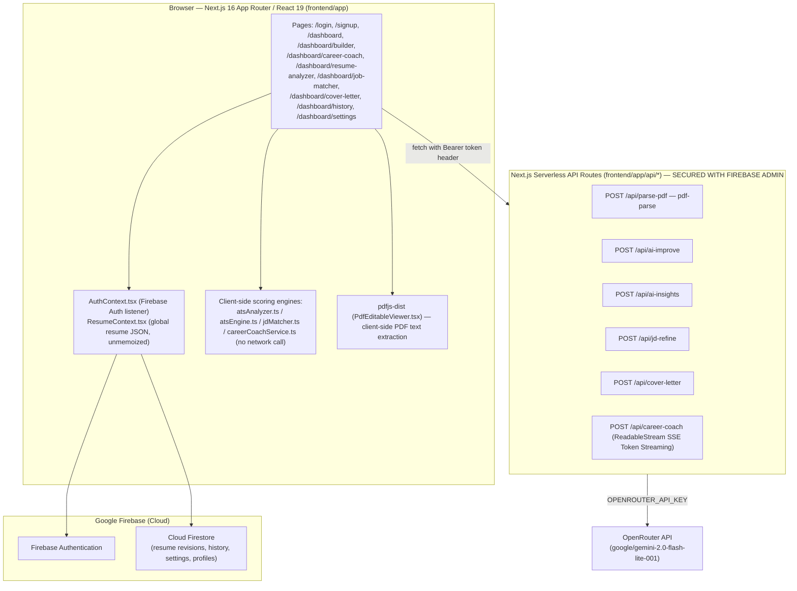

# HireLens 2.0 — Architecture

> Rewritten on Sprint 1, Day 5, grounded entirely in `PROJECT_DISCOVERY.md`, `ENVIRONMENT_VERIFICATION.md`, `BACKEND_AUDIT.md`, and `FRONTEND_AUDIT.md` (archived in `Sprint_01/_raw_findings/`). Every claim below traces to one of those four files. Nothing here is assumed.

## Current-State Architecture (Confirmed)



**Key architectural fact (confirmed, `BACKEND_AUDIT.md` §3):** the Next.js API layer holds **no database connection at all**. It is a stateless proxy to OpenRouter only, but is now protected by Firebase Admin SDK token verification. Every Firestore read/write (resume revisions, history, settings, profile, account deletion) happens **directly from the browser** via the Firebase Web SDK. There is no backend database connection beyond Firestore's own security rules (not yet audited — see Open Questions below).

## Known Issues (Confirmed, Cited — Sprint 1 Findings)

| # | Issue | Severity | Citation |
|---|---|---|---|
| ~~1~~ | ~~Production build fails — `Uint8Array` not assignable to `BlobPart`~~ | ~~Critical~~ | ~~`cover-letter/page.tsx:171`, `ENVIRONMENT_VERIFICATION.md` §4~~ |
| ~~2~~ | ~~Firestore collection casing mismatch (`"Users"` write vs. `"users"` read) breaks profile loading~~ | ~~Critical~~ | ~~`signup/page.tsx#L54`, `PROJECT_DISCOVERY.md` §19, §21~~ |
| ~~3~~ | ~~All `/api/*` routes have zero authentication — any client can incur OpenRouter billing or upload files~~ | ~~High~~ | ~~`BACKEND_AUDIT.md` §4~~ |
| 4 | No validation middleware (`middleware.ts`) — no CORS restriction, no rate limiting | High | `BACKEND_AUDIT.md` §4 |
| ~~5~~ | ~~Job Matcher AI insights fetched but never rendered~~ | ~~High~~ | ~~`JDMatcherPanel.tsx#L470`, `FRONTEND_AUDIT.md` §4~~ |
| 6 | Prompt injection risk — job description / custom text concatenated into prompts unsanitized | High | `BACKEND_AUDIT.md` §4 |
| ~~7~~ | ~~Firebase config hardcoded in `lib/firebase.ts`; `.env.example` Firebase vars exist but are unused~~ | ~~Medium~~ | ~~`ENVIRONMENT_VERIFICATION.md` §3, §5~~ |
| ~~8~~ | ~~Settings navbar link is a dead hash (`#profile`) instead of `/dashboard/settings`~~ | ~~Low~~ | ~~`Navbar.tsx#L120`, `FRONTEND_AUDIT.md` §4~~ |
| 9 | `ResumeContext.tsx` provider value unmemoized — every keystroke re-renders the full editor + preview tree | Medium (perf) | `FRONTEND_AUDIT.md` §2 |
| 10 | Word (.docx) export is an unimplemented placeholder | Medium (missing feature, not a defect) | `lib/exportService.ts`, `FRONTEND_AUDIT.md` §4 |
| 11 | Duplicate PDF parsing libraries (`pdf-parse` server-side, `pdfjs-dist` client-side) — bundle bloat | Low | `FRONTEND_AUDIT.md` §3 |

## Resolved Issues

| # | Issue | Severity | Resolution Date | Sprint Day | Resolution Note |
|---|---|---|---|---|---|
| 1 | Production build fails — `Uint8Array` not assignable to `BlobPart` | Critical | 2026-06-29 | Sprint 2, Day 1 | Cast `pdfBytes.buffer as ArrayBuffer` in the `Blob` constructor in `cover-letter/page.tsx` to satisfy DOM type checker. |
| 2 | Firestore collection casing mismatch (`"Users"` write vs. `"users"` read) breaks profile loading | Critical | 2026-06-29 | Sprint 2, Day 2 | Standardized casing on `"users"` (lowercase) in `signup/page.tsx` to match all existing profile display/settings query reads. |
| 3 | All `/api/*` routes have zero authentication | High | 2026-07-01 | Sprint 2, Day 3 | Integrated Firebase Admin SDK to verify Firebase Auth ID tokens server-side in all API routes. |
| 5 | Job Matcher AI insights fetched but never rendered | High | 2026-07-01 | Sprint 2, Day 4 | Rendered `aiInsights` inside its container with full support for the `isRefining` loading state in `JDMatcherPanel.tsx`. |
| 7 | Firebase config hardcoded in `lib/firebase.ts` | Medium | 2026-07-02 | Sprint 2, Day 5 | Sourced Firebase configuration from process.env.NEXT_PUBLIC_FIREBASE_* client variables. |
| 8 | Settings navbar link is a dead hash (`#profile`) | Low | 2026-07-01 | Sprint 2, Day 4 | Corrected profile link in `Navbar.tsx` to navigate directly to `/dashboard/settings`. |
| 9 | `keywordDensityScore` was static placeholder value (100) | Medium | 2026-07-24 | Sprint 3, Day 1 | `keywordDensityScore` in `lib/atsAnalyzer.ts` is now a real computed metric measuring skill keyword matches against resume text. |
| 10 | JD Matcher section scores were cosmetic bucket-fill approximations | Medium | 2026-07-24 | Sprint 3, Day 3 | Extended `analyzeJobMatch()` in `lib/jdMatcher.ts` with optional `resume?: Resume` parameter for structured section analysis, frequency weighting, and required/preferred skill detection. |
| 11 | `/api/ai-improve` returned 400 for achievements/certifications and lacked JD context | High | 2026-07-24 | Sprint 3, Day 4 | Expanded `validSections` in `/api/ai-improve/route.ts` to include achievements and certifications, added section prompts, and added optional `jobDescription` context support. Updated `lib/aiService.ts`. |
| 12 | Prompt strings were inline, duplicated across routes, and `ai-insights` lacked system prompt | Medium | 2026-07-24 | Sprint 3, Day 5 | Created `lib/promptTemplates.ts` as centralized prompt store, added `AI_INSIGHTS_SYSTEM_PROMPT` to `/api/ai-insights`, and aligned prompt guardrails in `ai-improve`, `jd-refine`, and `cover-letter`. |
| 13 | ATS Match & Resume Quality engines lacked centralized config, had duplicate logic, and produced inaccurate scores for non-employment resumes | High | 2026-07-25 | Sprint 3, Regression | Created `lib/atsConfig.ts` with `ATS_SCORING_CONFIG`, unified scoring via `atsEngine.ts`, implemented technical phrase extraction (Bigrams/Trigrams), filtered HR boilerplate, and calibrated ATS experience scoring. |


## Confirmed Technology Boundaries

- **No backend database client exists.** Sprint 2 work that "adds backend authentication" must introduce Firebase Admin SDK token verification into the existing serverless API routes — it does not introduce a new database layer, which does not exist server-side today.
- **No middleware file currently exists** (`middleware.ts` absent, per `BACKEND_AUDIT.md` §4). Any route-level auth check added in Sprint 2 either lives inside each route handler or introduces `middleware.ts` for the first time — this is a structural addition, not a modification, and must be logged in `20_Decision_Log.md`.

## Open Questions (Not Yet Verified — Do Not Assume)

- Firestore Security Rules have not been audited. The client writes directly to Firestore; whether Firestore rules themselves enforce any authorization is unknown and is a candidate for a dedicated audit before assuming client-side writes are "secured enough" long-term.
- Whether `OPENROUTER_API_KEY` has a billing cap or alert configured is unknown — relevant given Issue #3's unauthenticated-billing-abuse risk.

---

## Sprint 5 Architecture Additions

### Optimizer Prompt Architecture

`lib/promptTemplates.ts` (post Sprint 5, Day 1):
- `OptimizerMode` — union type: `"ats" | "impact" | "concise" | "action-verbs" | "jd-align"`
- `SECTION_BASE_PROMPTS` — record of section-specific base rewriting instructions
- `OPTIMIZER_MODE_PROMPTS` — record of mode-specific goal instructions
- `buildOptimizerPrompt(section, content, mode?, jobDescription?)` — pure function composing the full user prompt; unconditionally appends `HALLUCINATION_GUARDRAIL`

`app/api/ai-improve/route.ts` (post Sprint 5, Day 1):
- Accepts optional `mode?: string` — validated against `validModes[]`
- Accepts optional `jobDescription?: string` (existed since Sprint 3)
- Delegates all prompt construction to `buildOptimizerPrompt()` — no inline prompt strings remain

`lib/aiService.ts` (post Sprint 5, Day 1):
- `improveSection(section, content, token, jobDescription?, mode?)` — full signature

### Optimizer UI Components

`components/resume-builder/ResumeEditor.tsx` (post Sprint 5, Day 3):
- `jobDescription` local state (session-only, not persisted)
- `jdPanelOpen` local state for collapse toggle
- Collapsible JD context panel between tab row and form area
- Passes `jobDescription` prop to: PersonalInfoForm, ExperienceForm, ProjectsForm, AchievementsForm, CertificationsForm

`components/resume-builder/AIImprovementModal.tsx` (post Sprint 5, Day 4):
- New props: `onRegenerate?`, `optimizationMode?`, `isJdActive?`
- `onAccept(finalText: string)` — receives the (potentially edited) final text
- `localImprovedText` internal state — editable textarea synced from `improvedText` prop
- Footer: mode badge, JD Context badge, Regenerate button, Cancel, Accept

### Forms with AI Optimize Buttons (all 5 sections)
| Form | Section | Default Mode | Since |
|---|---|---|---|
| `PersonalInfoForm.tsx` | `summary` | none (base) | Sprint 3 |
| `ExperienceForm.tsx` | `experience` | none → `"action-verbs"` | Sprint 3 / Sprint 5 |
| `ProjectsForm.tsx` | `projects` | none (base) | Sprint 3 |
| `AchievementsForm.tsx` | `achievements` | `"impact"` | Sprint 5, Day 2 |
| `CertificationsForm.tsx` | `certifications` | none (base) | Sprint 5, Day 2 |

### Testing Infrastructure
| File | Purpose | Runner |
|---|---|---|
| `tests/atsBenchmark.test.ts` | ATS scoring accuracy and quality hierarchy | `npx tsx tests/atsBenchmark.test.ts` |
| `tests/optimizerSafety.test.ts` | Prompt guardrail presence, mode validation, JD injection | `npx tsx tests/optimizerSafety.test.ts` |

Both test files are plain TypeScript, no test framework. Both exit with code 1 on assertion failure.

---

## Sprint 6 Architecture — AI Career Coach

### New Components

**`lib/careerCoachService.ts`** — Pure client-side helper module (no side effects, no network calls). Exports:
- `ChatMessage`, `CareerCoachRequest`, `ATSContextInput` type definitions
- `buildResumeContextBlock(resume)` → structured plaintext (≤4000 tokens)
- `buildATSContextBlock(ats)` → labelled deterministic engine output block
- `buildJDContextBlock(jd)` → job description block with non-fabrication instruction
- `trimConversationHistory(messages, maxTurns=8)` → last N turns
- `hasResumeContent(resume)` → boolean
Fully testable without mocking. Tested in `tests/careerCoachSafety.test.ts`.

**`app/api/career-coach/route.ts`** — Authenticated streaming POST endpoint.
- Auth: `verifyAuth()` (same Firebase Admin pattern as all other AI routes)
- Input: `{ messages: ChatMessage[], resumeContext?, atsContext?, jobDescription? }`
- Validation: per-message length limit (4000 chars), role validation, field type checks
- History: server-enforces `trimConversationHistory(messages, 8)`
- Provider: OpenRouter `google/gemini-2.5-flash`, `stream: true`
- Response: `text/plain; charset=utf-8` streaming via native `ReadableStream`
- Error cases: 401 (auth), 400 (validation), 429 (rate limit), 502 (provider error)

**`app/dashboard/career-coach/page.tsx`** — Client component under `/dashboard/career-coach`.
- State: `messages`, `inputValue`, `isStreaming`, `error`, `jobDescription`, `jdPanelOpen`, `inspectorOpen`
- Context: `useAuth()` (Firebase token), `useResume()` (live resume data via `ResumeProvider` already in `layout.tsx`)
- Streaming: `fetch` + `response.body.getReader()` + `TextDecoder` — no new packages
- Cancellation: `AbortController` per request; cancelled on reset or unmount
- ATS: `analyzeResume(resume, false)` called client-side; result formatted via `buildATSContextBlock`
- Conversation history: last 8 turns sent on each request; turn count warning at ≥ 6 turns

### Navigation Update
`components/Sidebar.tsx` — `MessageSquare` icon added; "AI Career Coach" nav item is second entry (after Dashboard, before Resume Builder).

### Streaming Pattern (first use in codebase)
```
Server: new Response(new ReadableStream({...}), { Content-Type: "text/plain" })
Client: fetch(...) → response.body.getReader() → while (true) { reader.read() → decode → accumulate → setState }
```
No WebSockets, no `EventSource`, no SSE client protocol — raw streamed text.

### Career Coach Truth-Preservation Architecture
```
CAREER_COACH_SYSTEM_PROMPT (in promptTemplates.ts)
  ↓ contains: HALLUCINATION_GUARDRAIL + ATS attribution rules + identity constraints
      ↓
buildATSContextBlock() labels scores: "DETERMINISTIC ENGINE OUTPUT — not by AI estimation"
      ↓
buildResumeContextBlock() labels data: "from the candidate's HireLens resume — not from AI inference"
      ↓
buildJDContextBlock() labels JD: "do not claim candidate has skills not present in their resume"
```
Automated tests in `careerCoachSafety.test.ts` verify all three labels are present before any code ships.

### Testing Infrastructure (post Sprint 6)
| File | Tests | Runner |
|---|---|---|
| `tests/atsBenchmark.test.ts` | ATS scoring accuracy, quality hierarchy | `npx tsx tests/atsBenchmark.test.ts` |
| `tests/optimizerSafety.test.ts` | Prompt guardrails, optimizer modes, JD injection | `npx tsx tests/optimizerSafety.test.ts` |
| `tests/careerCoachSafety.test.ts` | Coach prompt rules, context builders, history trimming | `npx tsx tests/careerCoachSafety.test.ts` |

---

## Sprint 8 Architecture — CrewAI Multi-Agent System & AI-First Agent Workspace

> Planning-stage architecture. Implementation detail and any deltas discovered during build live in `Sprint_08/Day_01.md` through `Day_10.md`; this section is the pre-build design of record.

### High-Level System Diagram

```
                              USER (browser)
                                    |
                                    v
                       /dashboard/agent  (Agent Workspace)
                       new default post-login route
                                    |
                    fetch("/api/agent/chat", {messages, resume, jd?})
                                    v
   ================== EXISTING NEXT.JS APP (unchanged runtime) ==================
   |                                |                                            |
   |  /api/agent/chat/route.ts (NEW - authenticated proxy)                       |
   |     1. verifyAuth(req)        -> existing Firebase Admin check              |
   |     2. mint internal JWT {uid}                                              |
   |     3. POST to agent-service, stream NDJSON back verbatim                   |
   |                                                                              |
   |  /api/internal/ats-score  (NEW)  -> wraps atsEngine.ts / atsAnalyzer.ts     |
   |  /api/internal/jd-match   (NEW)  -> wraps jdMatcher.ts (analyzeJobMatch)    |
   |  /api/ai-improve           (EXISTING, unchanged) -> resume optimizer        |
   |  /api/cover-letter         (EXISTING, unchanged) -> cover letter generator  |
   |  /api/career-coach         (EXISTING, unchanged) -> standalone Coach chat   |
   ================================================================================
                                    |
                       X-Internal-Auth: <JWT>  (uid only, never trusted from body)
                                    v
                 ============ agent-service (NEW Python/FastAPI) ============
                 |                                                            |
                 |   POST /chat  ->  CrewAI hierarchical Crew, kicked off     |
                 |   with request-scoped context: {uid, resume, ats?, jd?}    |
                 |                                                            |
                 |                     MANAGER AGENT                          |
                 |             (intent detection + delegation)                |
                 |         /        |        |        |       |      \       |
                 |    Resume      ATS     Optimizer  Career  Job    Interview |
                 |    Agent      Agent     Agent     Agent  Search   Coach    |
                 |                                            Agent  Agent   |
                 |         \        |        |        |       |      /       |
                 |                  TOOLS (typed, Pydantic-validated)        |
                 |     get_resume · get_ats_analysis · optimize_section       |
                 |     generate_cover_letter · search_jobs · analyze_gap      |
                 |     prepare_interview_qs · evaluate_interview_answer       |
                 |                          |                                |
                 |         each tool either reads the request-scoped         |
                 |         context directly, or makes an authenticated       |
                 |         HTTPS call back into the Next.js internal/        |
                 |         existing endpoints above (never re-implements     |
                 |         their logic)                                      |
                 =============================================================
                                    |
                       AgentResponse {message, agent, status, actions, artifacts, ui}
                       streamed as NDJSON events
                                    v
                       Next.js proxy re-streams verbatim
                                    v
                       Browser: Agent Workspace renders Generative UI artifacts
                                    v
                       User: Apply / Reject on any proposed change
                                    v
                       Apply -> ResumeContext.updateResume() (client-side only)
```

### Agent Hierarchy — Core vs. Optional/Future vs. Deterministic Tools

**Core Sprint 8 Agents** (multi-step reasoning or specialized context justifies a dedicated agent):
| Agent | Responsibility | Tools it may call |
|---|---|---|
| Manager Agent | Intent detection, task planning, delegation, response assembly | none directly — delegates only |
| Resume Agent | Inspect resume state, identify missing sections, guide creation/editing, propose structured changes | `get_resume`, `propose_resume_change` |
| ATS Agent | Explain deterministic ATS results, prioritize fixes — never scores itself | `get_ats_analysis` |
| Optimizer Agent | Orchestrate the existing 5-mode resume optimizer | `optimize_resume_section` |
| Career Agent | Open-ended career coaching turns, ported Career Coach persona | `get_resume` (context only) |
| Job Search Agent | Find and rank job listings using resume/ATS context | `search_jobs`, `analyze_skill_gap` |
| Interview Coach Agent | Generate interview questions, evaluate answers, give feedback | `prepare_interview_questions`, `evaluate_interview_answer` |

**Deterministic Tools** (no dedicated agent — invoked directly by whichever agent needs them; see `20_Decision_Log.md` for why Cover Letter and Skill Gap are tools, not agents):
- `get_resume` — request-scoped context accessor (no DB call)
- `get_ats_analysis` — calls `/api/internal/ats-score`
- `optimize_resume_section` — calls existing `/api/ai-improve`
- `generate_cover_letter` — calls existing `/api/cover-letter`
- `analyze_skill_gap` — calls `/api/internal/jd-match`
- `search_jobs` — calls `JobProviderAdapter` (see Job Search Tool Contract below)
- `prepare_interview_questions` / `evaluate_interview_answer` — direct OpenRouter calls, no backend dependency
- `propose_resume_change` — pure function producing a structured diff artifact; never writes anywhere

**Optional / Future Agents** (explicitly deferred — see `20_Decision_Log.md`):
- Company Research Agent — no verified data source exists yet; requires a web-search/company-data tool not currently in scope
- Application Planning Agent — Sprint 8's "application workflow" is the Manager sequencing existing agents (Resume → ATS → Job → Skill Gap → Optimizer → Cover Letter), not a distinct reasoning role; promote to a dedicated agent only if that sequencing logic grows complex enough to need its own state machine
- Study Roadmap / dedicated Skill Gap Agent — full personalized learning-path generation remains Sprint 10 scope

### Sprint 8 Tool Contracts

```python
# resume_tools.py
def get_resume(ctx: RequestContext) -> ResumeSnapshot:
    """Returns the resume JSON the client sent with this request. No DB access."""

def propose_resume_change(section: str, item_id: str | None, before: str, after: str, rationale: str) -> ResumeDiffArtifact:
    """Pure function. Returns a structured diff artifact for UI review. Never mutates anything."""

# ats_tools.py
def get_ats_analysis(ctx: RequestContext, job_description: str | None = None) -> ATSResult:
    """Calls POST /api/internal/ats-score with {resume, jobDescription?} + internal JWT.
    Returns the exact ATSResult shape produced by atsEngine.ts - never recomputed locally."""

# optimizer_tools.py
def optimize_resume_section(section: str, content: str, mode: OptimizerMode, job_description: str | None = None) -> str:
    """Calls existing POST /api/ai-improve. Reuses all 5 existing modes unchanged."""

# cover_letter_tools.py
def generate_cover_letter(job_title: str, company_name: str, tone: str, job_description: str | None = None) -> str:
    """Calls existing POST /api/cover-letter with action=generate. Resume text sourced from ctx.resume."""

# job_search_tools.py
class JobProviderAdapter(Protocol):
    async def search(self, query: JobSearchQuery) -> list[NormalizedJobListing]: ...

def search_jobs(ctx: RequestContext, query: JobSearchQuery) -> list[NormalizedJobListing]:
    """Delegates to the configured JobProviderAdapter (NullJobProvider until a real
    provider is selected - see 20_Decision_Log.md). Never scrapes directly."""

# skill_gap_tools.py
def analyze_skill_gap(ctx: RequestContext, job_description: str) -> SkillGapResult:
    """Calls POST /api/internal/jd-match, wrapping jdMatcher.ts's analyzeJobMatch().
    Returns matched/missing skills - never invents a candidate skill not in the resume."""

# interview_tools.py
def prepare_interview_questions(ctx: RequestContext, job_description: str | None, focus: str | None) -> list[InterviewQuestion]:
    """Direct OpenRouter call. Grounded in resume + JD only - no fabricated candidate facts assumed."""

def evaluate_interview_answer(question: str, answer: str, ctx: RequestContext) -> InterviewFeedback:
    """Direct OpenRouter call. Feedback on clarity/structure/specificity - never a pass/fail verdict."""
```

### New Internal Next.js Endpoints (Sprint 8)

| Route | Wraps | Auth | Notes |
|---|---|---|---|
| `POST /api/internal/ats-score` | `atsEngine.ts` + `atsAnalyzer.ts` (`analyzeResumeQuality` / `analyzeResumeMatch`) | Internal JWT (`X-Internal-Auth`), not a Firebase user token | Deterministic; same code path the client already uses via `atsAnalyzer.ts`, exposed over HTTP for the Python service |
| `POST /api/internal/jd-match` | `jdMatcher.ts` (`analyzeJobMatch`) | Internal JWT | Powers `analyze_skill_gap` |

Both routes are **internal-only by convention** (not enforced by network topology in Sprint 8, since `agent-service` is a separate deploy target reachable over the public internet) — enforced instead by requiring the internal JWT, which only the Next.js proxy can mint. A public caller without that JWT receives `401`.

### Generative UI — Structured Response Protocol

```typescript
interface AgentResponse {
  message: string;                 // agent's natural-language reply
  agent: string;                   // which agent produced this (for the activity trace)
  status: "in_progress" | "completed" | "needs_input" | "error";
  actions: AgentAction[];          // e.g. { label: "Apply", type: "apply_resume_diff", payload }
  artifacts: Artifact[];           // typed UI artifacts, closed set - see below
  ui?: { layout?: "default" | "split" };
}

type Artifact =
  | { type: "ats_score_card"; data: ATSResult }
  | { type: "resume_diff"; data: { section: string; itemId?: string; before: string; after: string; rationale: string } }
  | { type: "job_result_card"; data: NormalizedJobListing[] }
  | { type: "skill_gap_card"; data: SkillGapResult }
  | { type: "cover_letter_preview"; data: { content: string } }
  | { type: "interview_question_card"; data: InterviewQuestion[] }
  | { type: "agent_activity"; data: { steps: { agent: string; status: "pending"|"active"|"done"|"error" }[] } }
  | { type: "task_progress"; data: { label: string; percent: number } };
```

The frontend (`components/agent/ArtifactRenderer.tsx`) switches on `artifact.type` against this closed union — an unrecognized type is dropped with a console warning, never rendered as raw HTML/markdown-as-UI. This is the concrete mechanism satisfying "the model must NOT be allowed to generate arbitrary executable UI."

### Streaming Event Schema (NDJSON, one JSON object per line)

```typescript
type AgentEvent =
  | { type: "agent_started"; agent: string }
  | { type: "agent_completed"; agent: string }
  | { type: "tool_started"; agent: string; tool: string }
  | { type: "tool_completed"; agent: string; tool: string }
  | { type: "message_delta"; agent: string; text: string }
  | { type: "artifact"; artifact: Artifact }
  | { type: "action_required"; actions: AgentAction[] }
  | { type: "error"; message: string }
  | { type: "completed" };
```
No event carries hidden chain-of-thought — only high-level status labels ("Reading resume", "Running ATS analysis", "Generating improvement"), matching the brief's "do not expose internal chain-of-thought" requirement.

### Resume Safety — Apply/Reject Enforcement Path

```
Optimizer Agent calls optimize_resume_section()
  -> returns improved text (string)
Resume Agent wraps it via propose_resume_change()
  -> ResumeDiffArtifact { before, after, rationale }  (pure, no mutation)
NDJSON "artifact" event { type: "resume_diff", data }
  -> Agent Workspace renders diff with [Apply] [Reject]
User clicks Apply
  -> client-side only: useResume().updateResume({...}) via ResumeContext
  -> agent-service and Firestore are never touched by this step
```
This is the literal mechanism behind the non-negotiable "the agent must never silently modify the user's resume" rule — the mutation function (`updateResume`) is only ever called from a client-side click handler, never from anything agent- or server-driven.

### State Management Classification

| State | Scope | Where it lives |
|---|---|---|
| Resume being edited | Request-scoped (sent fresh each call) | `ResumeContext` (client React state) — unchanged from pre-Sprint-8 |
| Agent conversation history | Session-scoped | Client `useState` in `app/dashboard/agent/page.tsx`, same pattern as Sprint 6 Career Coach |
| ATS result | Request-scoped | Computed client-side via `analyzeResume()` or returned fresh by `get_ats_analysis` per call — never cached server-side |
| Daily request count | Persistent (minimal) | `users/{uid}/agentUsage/{date}` — the one new Firestore collection |
| Agent "memory" / cross-session context | **Not implemented** | Explicitly deferred; see `20_Decision_Log.md` |

### Security Architecture Summary
- **Cross-user data access:** prevented by the internal JWT carrying only a server-verified `uid`; no tool ever accepts a client-supplied `userId`.
- **Prompt injection (resume/JD content):** every tool that forwards resume or JD text into a prompt continues to apply the existing `HALLUCINATION_GUARDRAIL` pattern; job descriptions and resume free-text are treated as untrusted content in the prompt, never as instructions.
- **Tool injection / unauthorized tool execution:** each agent's tool list is a hard-coded Python allowlist (not model-selectable at runtime) — an agent cannot invoke a tool CrewAI didn't explicitly register for it, tested in `agent-service/tests/test_tool_authorization.py`.
- **Runaway costs / loops:** `max_iter`, wall-clock timeouts, token caps, and the daily Firestore counter (see `10_CrewAI_Guide.md`).
- **Malformed structured responses:** every `AgentResponse` and `AgentEvent` validates against its Pydantic schema before being emitted; a validation failure becomes a structured `error` event, not a malformed stream.

### Existing Features — Explicitly Unmodified
Resume Builder, ATS Analyzer, Resume Optimizer forms, Cover Letter page, standalone Career Coach page, Firebase Auth, Firestore history/profile, and all three existing test suites (`atsBenchmark`, `optimizerSafety`, `careerCoachSafety`) continue to run exactly as before Sprint 8. Sprint 8 adds a new default landing route and new internal endpoints; it does not touch the code paths behind any existing Sidebar entry.

---

## Sprint 9 Architecture — AI Interview Coach: Mock Interview Sessions, Adaptive Follow-Up & Feedback

> Planning-stage architecture. Builds directly on the Sprint 8 architecture above, corrected against the actual delivered system per `20_Decision_Log.md`'s Sprint 9 audit ADRs — see especially the routing-mechanism correction. Implementation detail lives in `Sprint_09/Day_01.md` through `Day_10.md`.

### What Sprint 8 Already Delivered (Existing — Not Rebuilt)
| Capability | Status | Location |
|---|---|---|
| `prepare_interview_questions` tool | Working, tested, reachable via Route 4 | `agent-service/tools/interview_tools.py` |
| `evaluate_interview_answer` tool | Working, tested, **but unreachable** — no route calls it | `agent-service/tools/interview_tools.py` |
| `interview_coach_agent` (CrewAI Agent object) | Defined, tool-authorized, not delegated to via `kickoff()` (see routing correction) | `agent-service/crew/agents/interview_coach_agent.py` |
| `INTERVIEW_GUARDRAIL` anti-fabrication prompt text | Working, covers resume-fact-vs-JD-requirement distinction and no-verdicts rule | `agent-service/tools/interview_tools.py` |
| `interview_question_card` artifact + `InterviewQuestionCard.tsx` | Renders a static list of questions with expandable tips only | `frontend/types/agent.ts`, `frontend/components/agent/artifacts/InterviewQuestionCard.tsx` |
| Route 4 (`"interview"`/`"mock"`/`"questions"`/`"prep"` keywords) | Generates 5 hardcoded-role questions once; no session, no answer path | `agent-service/crew/manager.py` |

### Sprint 9 Target Data Flow
```
User: "Prepare me for a technical interview" (or continues an in-progress session)
  -> POST /api/agent/chat { messages, resume, job_description?, interview_session? }
  -> Next.js proxy: verifyAuth, mint internal JWT, forward (UNCHANGED from Sprint 8)
  -> agent-service /chat -> process_manager_request_async
       IF no interview_session in payload AND message matches interview-start intent:
           -> interview_manager.start_session(role, jd, resume, interview_type, difficulty, count)
                -> tool: prepare_interview_questions(interview_type, difficulty, resume_text, job_description)
                -> returns InterviewSessionState with question_index=0
                -> emits artifact: interview_question_card (isActive=true, question[0])
       IF interview_session present AND payload contains a pendingAnswer for the active question:
           -> interview_manager.process_answer(session, pendingAnswer)
                -> tool: evaluate_interview_answer(question, answer, resume_text)
                -> emits artifact: interview_feedback_card
                -> interview_manager decides: adaptive follow-up vs. next planned question
                     IF follow-up warranted -> tool: generate_follow_up_question(...)
                     ELSE -> advance question_index, present next question from the plan
                -> IF question_index >= total -> interview_manager.complete_session(session)
                     -> tool: generate_interview_report(session)
                     -> emits artifact: interview_report_card
                -> ELSE emits artifact: interview_question_card (isActive=true, next question)
       -> updated InterviewSessionState returned to client in the response payload (client is the only place it's stored)
  -> Agent Workspace renders the new/updated artifact; user answers or reviews the report
```

### Interview Manager — Not a New Agent
Per `20_Decision_Log.md`, `agent-service/crew/interview_manager.py` is a plain Python module, not a CrewAI `Agent`. Total agent count remains **7** (1 Manager + 6 specialized: Resume, ATS, Optimizer, Career, Job Search, Interview Coach) — unchanged from Sprint 8. `interview_coach_agent`'s tool list grows from 2 to 4 tools.

### Sprint 9 Tool Contracts (2 new; 2 existing extended)
```python
# interview_tools.py (existing file, extended)

@tool("prepare_interview_questions")
def prepare_interview_questions(
    role: str = "Software Engineer",
    count: int = 5,
    resume_text: Optional[str] = None,
    job_description: Optional[str] = None,
    interview_type: Literal["hr", "behavioral", "technical", "mixed"] = "mixed",   # NEW param
    difficulty: Literal["beginner", "intermediate", "advanced"] = "intermediate",   # NEW param
) -> str:
    """Existing tool, extended with interview_type/difficulty. Signature is backward compatible -
    both new params have defaults, so Sprint 8's Route 4 call site continues to work unchanged."""

@tool("evaluate_interview_answer")
def evaluate_interview_answer(question: str, answer: str, resume_text: Optional[str] = None) -> str:
    """UNCHANGED from Sprint 8. Sprint 9's only job here is to make this tool REACHABLE
    by wiring it into interview_manager.process_answer(). No signature or behavior change."""

@tool("generate_follow_up_question")
def generate_follow_up_question(
    original_question: str,
    candidate_answer: str,
    identified_gap: str,          # e.g. "unclear personal technical contribution"
    resume_text: Optional[str] = None,
) -> str:
    """NEW. Generates one targeted follow-up question addressing a specific gap identified
    in evaluate_interview_answer's feedback. Shares INTERVIEW_GUARDRAIL. Never asks about
    a gap the resume/JD doesn't support investigating."""

@tool("generate_interview_report")
def generate_interview_report(session: InterviewSessionState) -> str:
    """NEW. Summarizes a completed session: per-category readiness (qualitative labels only,
    see 20_Decision_Log.md's 'no numeric interview score' ADR), strengths, improvement areas,
    and recommended practice topics. Explicitly flags any area with insufficient resume/JD
    evidence rather than guessing."""
```

### New Artifact Types
```typescript
// Extends the existing 8-type closed union to 10 types
export interface InterviewQuestionItem {
  id: string;
  question: string;
  category?: string;
  difficulty?: "Easy" | "Medium" | "Hard" | string;
  keyTips?: string[];
  // NEW, optional - only present when part of an active session:
  isActive?: boolean;
  sessionId?: string;
  questionIndex?: number;
  totalQuestions?: number;
}
// InterviewQuestionArtifactData is unchanged in shape (still { questions: InterviewQuestionItem[] });
// a single-item array with isActive=true represents "the current question awaiting an answer."

export interface InterviewFeedbackArtifactData {
  question: string;
  answer: string;
  clarity: string;
  structure: string;
  specificity: string;
  technical_depth: string;
  strengths: string[];
  improvements: string[];
  suggested_answer_direction: string;
}
export type InterviewFeedbackArtifact = { id?: string; title?: string; type: "interview_feedback_card"; data: InterviewFeedbackArtifactData };

export interface InterviewReportArtifactData {
  interviewType: string;
  targetRole: string;
  questionsAsked: number;
  readinessByCategory: Record<string, "Strong" | "Moderate" | "Needs Improvement">;  // qualitative only
  strengths: string[];
  improvementAreas: string[];
  priorityTopics: string[];
  note: string;   // "These are coaching recommendations, not guaranteed measurements."
}
export type InterviewReportArtifact = { id?: string; title?: string; type: "interview_report_card"; data: InterviewReportArtifactData };
```

### Interview Session State (Request-Scoped, Client-Held)
```typescript
export interface InterviewSessionState {
  sessionId: string;
  interviewType: "hr" | "behavioral" | "technical" | "mixed";
  targetRole: string;
  difficulty: "beginner" | "intermediate" | "advanced";
  questionIndex: number;
  questionsAsked: InterviewQuestionItem[];
  answersGiven: { questionId: string; answer: string; feedback: InterviewFeedbackArtifactData }[];
  status: "in_progress" | "completed";
}
```
Sent as a new optional `interview_session` field on `AgentStreamPayload` (alongside the existing `resume`, `attachments`). Never written to Firestore; never read by any tool except via this per-request payload. See `20_Decision_Log.md` for the full rationale and the explicit rejection of a persistent `interviewSessions` collection for Sprint 9 MVP.

### Adaptive Follow-Up Decision Rule (Transparent, Not Hidden ML)
```
after evaluate_interview_answer returns feedback:
  IF len(feedback.improvements) >= 2 AND "unclear" or "specific" appears in feedback text:
      -> generate ONE follow-up question targeting the clearest gap, difficulty unchanged
  ELSE IF feedback indicates a strong answer (few/no improvements, resume-grounded specifics present):
      -> advance to next planned question, difficulty steps up one level (beginner->intermediate->advanced, capped)
  ELSE:
      -> advance to next planned question, difficulty unchanged
```
This rule is implemented as plain Python conditionals in `interview_manager.py`, not a separate scoring model — documented here in full so its behavior is auditable, per the brief's "avoid arbitrary score manipulation... document the exact behavior" requirement.

### Streaming — No New Event Types
Interview session moments reuse the existing 9 `AgentEvent` types exactly as delivered in Sprint 8 (`agent_started`, `agent_completed`, `tool_started`, `tool_completed`, `message_delta`, `artifact`, `action_required`, `error`, `completed`). See `20_Decision_Log.md`'s "No new streaming event types" ADR for the full mapping from the brief's suggested interview-specific event names onto this existing vocabulary.

### Security — Extends Sprint 8's Model Unchanged
- **Cross-user session access:** impossible by construction — there is no server-side session lookup by ID for another user to guess; the only copy of a session's state is in the requesting user's own already-authenticated browser session and request body.
- **Malicious answer content:** candidate answers are treated as DATA inside the evaluation prompt, never concatenated as instructions — same pattern as resume/JD handling throughout Sprint 8.
- **Session state tampering:** since the client holds the canonical session copy, a malicious client could in principle submit a fabricated `questionsAsked`/`answersGiven` history. This has no security consequence (no other user's data is reachable this way, and the worst case is a candidate lying to their own practice tool) but is documented explicitly in `26_Risks.md` for completeness.
- **Cost/loop bounds:** new `MAX_QUESTIONS_PER_SESSION` (15, matching the brief's suggested ceiling) and `MAX_FOLLOW_UPS_PER_QUESTION` (1, preventing an infinite adaptive-follow-up chain) constants in `interview_manager.py`, on top of Sprint 8's existing daily `agentUsage` counter (each turn of a session is still one `/api/agent/chat` call, so long sessions are naturally rate-limited too).

### Existing Features — Explicitly Unmodified
Resume Builder, ATS Analyzer, Resume Optimizer, Cover Letter, Career Coach, Job Search, the Agent Workspace shell, all 7 existing agents' other tool paths, and the full Sprint 8 test suite continue to run exactly as before Sprint 9. Sprint 9 only extends `interview_tools.py`, adds `interview_manager.py`, extends Route 4, and adds/extends the interview-specific frontend artifacts.
