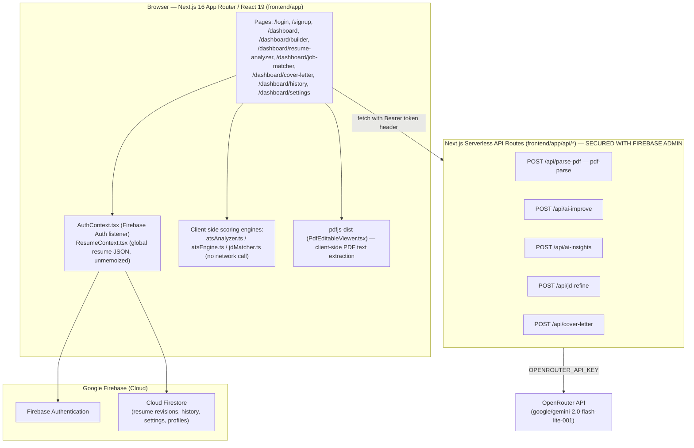

# HireLens 2.0 — Architecture

> Rewritten on Sprint 1, Day 5, grounded entirely in `PROJECT_DISCOVERY.md`, `ENVIRONMENT_VERIFICATION.md`, `BACKEND_AUDIT.md`, and `FRONTEND_AUDIT.md` (archived in `Sprint_01/_raw_findings/`). Every claim below traces to one of those four files. Nothing here is assumed.

## Current-State Architecture (Confirmed)

**Key architectural fact (confirmed, `BACKEND_AUDIT.md` §3):** the Next.js API layer holds **no database connection at all**. It is a stateless proxy to OpenRouter only, but is now protected by Firebase Admin SDK token verification. Every Firestore read/write (resume revisions, history, settings, profile, account deletion) happens **directly from the browser** via the Firebase Web SDK. There is no backend database connection beyond Firestore's own security rules (not yet audited — see Open Questions below).

## Known Issues (Confirmed, Cited — Sprint 1 Findings)

| # | Issue | Severity | Citation |
|---|---|---|---|
| ~~1~~ | ~~Production build fails — `Uint8Array` not assignable to `BlobPart`~~ | ~~Critical~~ | ~~`cover-letter/page.tsx:171`, `ENVIRONMENT_VERIFICATION.md` §4~~ |
| ~~2~~ | ~~Firestore collection casing mismatch (`"Users"` write vs. `"users"` read) breaks profile loading~~ | ~~Critical~~ | ~~`signup/page.tsx#L54`, `PROJECT_DISCOVERY.md` §19, §21~~ |
| ~~3~~ | ~~All `/api/*` routes have zero authentication — any client can incur OpenRouter billing or upload files~~ | ~~High~~ | ~~`BACKEND_AUDIT.md` §4~~ |
| 4 | No validation middleware (`middleware.ts`) — no CORS restriction, no rate limiting | High | `BACKEND_AUDIT.md` §4 |
| 5 | Job Matcher AI insights fetched but never rendered | High | `JDMatcherPanel.tsx#L470`, `FRONTEND_AUDIT.md` §4 |
| 6 | Prompt injection risk — job description / custom text concatenated into prompts unsanitized | High | `BACKEND_AUDIT.md` §4 |
| 7 | Firebase config hardcoded in `lib/firebase.ts`; `.env.example` Firebase vars exist but are unused | Medium | `ENVIRONMENT_VERIFICATION.md` §3, §5 |
| 8 | Settings navbar link is a dead hash (`#profile`) instead of `/dashboard/settings` | Low | `Navbar.tsx#L120`, `FRONTEND_AUDIT.md` §4 |
| 9 | `ResumeContext.tsx` provider value unmemoized — every keystroke re-renders the full editor + preview tree | Medium (perf) | `FRONTEND_AUDIT.md` §2 |
| 10 | Word (.docx) export is an unimplemented placeholder | Medium (missing feature, not a defect) | `lib/exportService.ts`, `FRONTEND_AUDIT.md` §4 |
| 11 | Duplicate PDF parsing libraries (`pdf-parse` server-side, `pdfjs-dist` client-side) — bundle bloat | Low | `FRONTEND_AUDIT.md` §3 |

## Resolved Issues

| # | Issue | Severity | Resolution Date | Sprint Day | Resolution Note |
|---|---|---|---|---|---|
| 1 | Production build fails — `Uint8Array` not assignable to `BlobPart` | Critical | 2026-06-29 | Sprint 2, Day 1 | Cast `pdfBytes.buffer as ArrayBuffer` in the `Blob` constructor in `cover-letter/page.tsx` to satisfy DOM type checker. |
| 2 | Firestore collection casing mismatch (`"Users"` write vs. `"users"` read) breaks profile loading | Critical | 2026-06-29 | Sprint 2, Day 2 | Standardized casing on `"users"` (lowercase) in `signup/page.tsx` to match all existing profile display/settings query reads. |
| 3 | All `/api/*` routes have zero authentication | High | 2026-07-01 | Sprint 2, Day 3 | Integrated Firebase Admin SDK to verify Firebase Auth ID tokens server-side in all API routes. |

## Confirmed Technology Boundaries

- **No backend database client exists.** Sprint 2 work that "adds backend authentication" must introduce Firebase Admin SDK token verification into the existing serverless API routes — it does not introduce a new database layer, which does not exist server-side today.
- **No middleware file currently exists** (`middleware.ts` absent, per `BACKEND_AUDIT.md` §4). Any route-level auth check added in Sprint 2 either lives inside each route handler or introduces `middleware.ts` for the first time — this is a structural addition, not a modification, and must be logged in `20_Decision_Log.md`.

## Open Questions (Not Yet Verified — Do Not Assume)

- Firestore Security Rules have not been audited. The client writes directly to Firestore; whether Firestore rules themselves enforce any authorization is unknown and is a candidate for a dedicated audit before assuming client-side writes are "secured enough" long-term.
- Whether `OPENROUTER_API_KEY` has a billing cap or alert configured is unknown — relevant given Issue #3's unauthenticated-billing-abuse risk.
