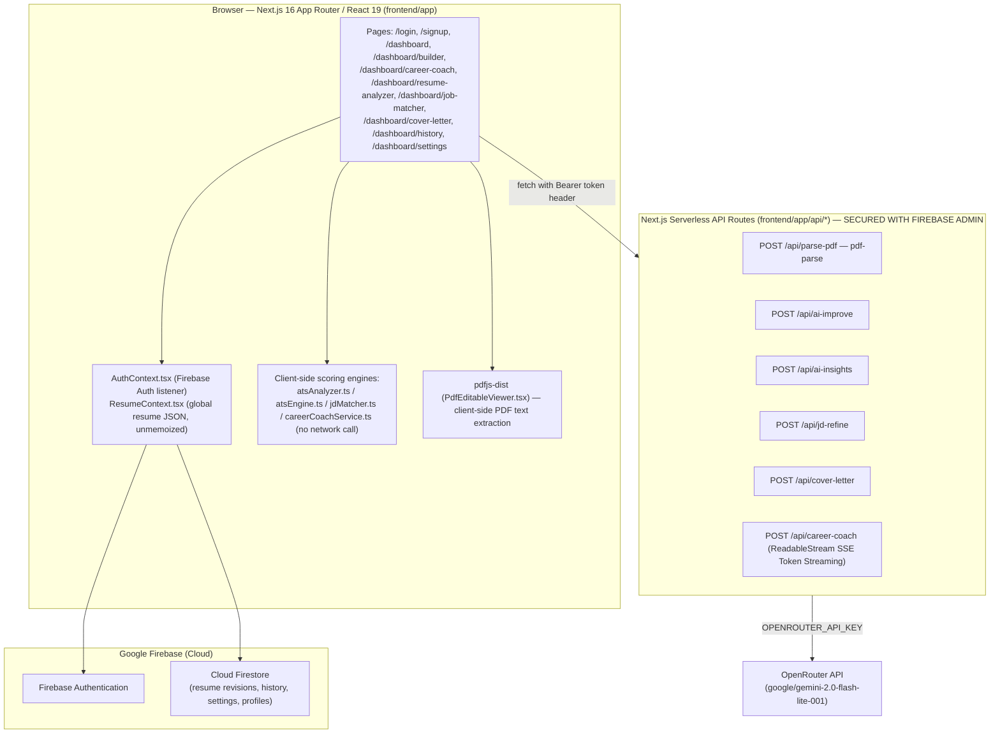

# HireLens 2.0 — Architecture

> Rewritten on Sprint 1, Day 5, grounded entirely in `PROJECT_DISCOVERY.md`, `ENVIRONMENT_VERIFICATION.md`, `BACKEND_AUDIT.md`, and `FRONTEND_AUDIT.md` (archived in `Sprint_01/_raw_findings/`). Every claim below traces to one of those four files. Nothing here is assumed.

## Current-State Architecture (Confirmed)


```mermaid
flowchart TD
    subgraph Client["Browser — Next.js 16 App Router / React 19 (frontend/app)"]
        Pages["Pages: /login, /signup, /dashboard, /dashboard/builder,\n/dashboard/career-coach, /dashboard/resume-analyzer, /dashboard/job-matcher,\n/dashboard/cover-letter, /dashboard/history, /dashboard/settings"]
        Contexts["AuthContext.tsx (Firebase Auth listener)\nResumeContext.tsx (global resume JSON, unmemoized)"]
        LocalEngines["Client-side scoring engines:\natsAnalyzer.ts / atsEngine.ts / jdMatcher.ts / careerCoachService.ts (no network call)"]
        ClientPDF["pdfjs-dist (PdfEditableViewer.tsx) — client-side PDF text extraction"]
    end

    subgraph FirebaseCloud["Google Firebase (Cloud)"]
        Auth["Firebase Authentication"]
        Firestore["Cloud Firestore\n(resume revisions, history, settings, profiles)"]
    end

    subgraph ServerlessAPI["Next.js Serverless API Routes (frontend/app/api/*) — SECURED WITH FIREBASE ADMIN"]
        ParsePdf["POST /api/parse-pdf — pdf-parse"]
        AiImprove["POST /api/ai-improve"]
        AiInsights["POST /api/ai-insights"]
        JdRefine["POST /api/jd-refine"]
        CoverLetter["POST /api/cover-letter"]
        CareerCoach["POST /api/career-coach (ReadableStream SSE Token Streaming)"]
    end

    OpenRouter["OpenRouter API\n(google/gemini-2.0-flash-lite-001)"]

    Pages --> Contexts
    Contexts --> Auth
    Contexts --> Firestore
    Pages --> LocalEngines
    Pages --> ClientPDF
    Pages -->|fetch with Bearer token header| ServerlessAPI
    ServerlessAPI -->|OPENROUTER_API_KEY| OpenRouter
```

**Key architectural fact (confirmed, `BACKEND_AUDIT.md` §3):** the Next.js API layer holds **no database connection at all**. It is a stateless proxy to OpenRouter only, but is now protected by Firebase Admin SDK token verification. Every Firestore read/write (resume revisions, history, settings, profile, account deletion) happens **directly from the browser** via the Firebase Web SDK. There is no backend database connection beyond Firestore's own security rules (not yet audited — see Open Questions below).

## Known Issues (Confirmed, Cited — Sprint 1 Findings)

| # | Issue | Severity | Citation |
|---|---|---|---|
| ~~1~~ | ~~Production build fails — `Uint8Array` not assignable to `BlobPart`~~ | ~~Critical~~ | ~~`cover-letter/page.tsx:171`, `ENVIRONMENT_VERIFICATION.md` §4~~ |
| ~~2~~ | ~~Firestore collection casing mismatch (`"Users"` write vs. `"users"` read) breaks profile loading~~ | ~~Critical~~ | ~~`signup/page.tsx#L54`, `PROJECT_DISCOVERY.md` §19, §21~~ |
| ~~3~~ | ~~All `/api/*` routes have zero authentication — any client can incur OpenRouter billing or upload files~~ | ~~High~~ | ~~`BACKEND_AUDIT.md` §4~~ |
| 4 | No validation middleware (`middleware.ts`) — no CORS restriction, no rate limiting | High | `BACKEND_AUDIT.md` §4 |
| ~~5~~ | ~~Job Matcher AI insights fetched but never rendered~~ | ~~High~~ | ~~`JDMatcherPanel.tsx#L470`, `FRONTEND_AUDIT.md` §4~~ |
| 6 | Prompt injection risk — job description / custom text concatenated into prompts unsanitized | High | `BACKEND_AUDIT.md` §4 |
| ~~7~~ | ~~Firebase config hardcoded in `lib/firebase.ts`; `.env.example` Firebase vars exist but are unused~~ | ~~Medium~~ | ~~`ENVIRONMENT_VERIFICATION.md` §3, §5~~ |
| ~~8~~ | ~~Settings navbar link is a dead hash (`#profile`) instead of `/dashboard/settings`~~ | ~~Low~~ | ~~`Navbar.tsx#L120`, `FRONTEND_AUDIT.md` §4~~ |
| 9 | `ResumeContext.tsx` provider value unmemoized — every keystroke re-renders the full editor + preview tree | Medium (perf) | `FRONTEND_AUDIT.md` §2 |
| 10 | Word (.docx) export is an unimplemented placeholder | Medium (missing feature, not a defect) | `lib/exportService.ts`, `FRONTEND_AUDIT.md` §4 |
| 11 | Duplicate PDF parsing libraries (`pdf-parse` server-side, `pdfjs-dist` client-side) — bundle bloat | Low | `FRONTEND_AUDIT.md` §3 |

## Resolved Issues

| # | Issue | Severity | Resolution Date | Sprint Day | Resolution Note |
|---|---|---|---|---|---|
| 1 | Production build fails — `Uint8Array` not assignable to `BlobPart` | Critical | 2026-06-29 | Sprint 2, Day 1 | Cast `pdfBytes.buffer as ArrayBuffer` in the `Blob` constructor in `cover-letter/page.tsx` to satisfy DOM type checker. |
| 2 | Firestore collection casing mismatch (`"Users"` write vs. `"users"` read) breaks profile loading | Critical | 2026-06-29 | Sprint 2, Day 2 | Standardized casing on `"users"` (lowercase) in `signup/page.tsx` to match all existing profile display/settings query reads. |
| 3 | All `/api/*` routes have zero authentication | High | 2026-07-01 | Sprint 2, Day 3 | Integrated Firebase Admin SDK to verify Firebase Auth ID tokens server-side in all API routes. |
| 5 | Job Matcher AI insights fetched but never rendered | High | 2026-07-01 | Sprint 2, Day 4 | Rendered `aiInsights` inside its container with full support for the `isRefining` loading state in `JDMatcherPanel.tsx`. |
| 7 | Firebase config hardcoded in `lib/firebase.ts` | Medium | 2026-07-02 | Sprint 2, Day 5 | Sourced Firebase configuration from process.env.NEXT_PUBLIC_FIREBASE_* client variables. |
| 8 | Settings navbar link is a dead hash (`#profile`) | Low | 2026-07-01 | Sprint 2, Day 4 | Corrected profile link in `Navbar.tsx` to navigate directly to `/dashboard/settings`. |
| 9 | `keywordDensityScore` was static placeholder value (100) | Medium | 2026-07-24 | Sprint 3, Day 1 | `keywordDensityScore` in `lib/atsAnalyzer.ts` is now a real computed metric measuring skill keyword matches against resume text. |
| 10 | JD Matcher section scores were cosmetic bucket-fill approximations | Medium | 2026-07-24 | Sprint 3, Day 3 | Extended `analyzeJobMatch()` in `lib/jdMatcher.ts` with optional `resume?: Resume` parameter for structured section analysis, frequency weighting, and required/preferred skill detection. |
| 11 | `/api/ai-improve` returned 400 for achievements/certifications and lacked JD context | High | 2026-07-24 | Sprint 3, Day 4 | Expanded `validSections` in `/api/ai-improve/route.ts` to include achievements and certifications, added section prompts, and added optional `jobDescription` context support. Updated `lib/aiService.ts`. |
| 12 | Prompt strings were inline, duplicated across routes, and `ai-insights` lacked system prompt | Medium | 2026-07-24 | Sprint 3, Day 5 | Created `lib/promptTemplates.ts` as centralized prompt store, added `AI_INSIGHTS_SYSTEM_PROMPT` to `/api/ai-insights`, and aligned prompt guardrails in `ai-improve`, `jd-refine`, and `cover-letter`. |
| 13 | ATS Match & Resume Quality engines lacked centralized config, had duplicate logic, and produced inaccurate scores for non-employment resumes | High | 2026-07-25 | Sprint 3, Regression | Created `lib/atsConfig.ts` with `ATS_SCORING_CONFIG`, unified scoring via `atsEngine.ts`, implemented technical phrase extraction (Bigrams/Trigrams), filtered HR boilerplate, and calibrated ATS experience scoring. |


## Confirmed Technology Boundaries

- **No backend database client exists.** Sprint 2 work that "adds backend authentication" must introduce Firebase Admin SDK token verification into the existing serverless API routes — it does not introduce a new database layer, which does not exist server-side today.
- **No middleware file currently exists** (`middleware.ts` absent, per `BACKEND_AUDIT.md` §4). Any route-level auth check added in Sprint 2 either lives inside each route handler or introduces `middleware.ts` for the first time — this is a structural addition, not a modification, and must be logged in `20_Decision_Log.md`.

## Open Questions (Not Yet Verified — Do Not Assume)

- Firestore Security Rules have not been audited. The client writes directly to Firestore; whether Firestore rules themselves enforce any authorization is unknown and is a candidate for a dedicated audit before assuming client-side writes are "secured enough" long-term.
- Whether `OPENROUTER_API_KEY` has a billing cap or alert configured is unknown — relevant given Issue #3's unauthenticated-billing-abuse risk.

---

## Sprint 5 Architecture Additions

### Optimizer Prompt Architecture

`lib/promptTemplates.ts` (post Sprint 5, Day 1):
- `OptimizerMode` — union type: `"ats" | "impact" | "concise" | "action-verbs" | "jd-align"`
- `SECTION_BASE_PROMPTS` — record of section-specific base rewriting instructions
- `OPTIMIZER_MODE_PROMPTS` — record of mode-specific goal instructions
- `buildOptimizerPrompt(section, content, mode?, jobDescription?)` — pure function composing the full user prompt; unconditionally appends `HALLUCINATION_GUARDRAIL`

`app/api/ai-improve/route.ts` (post Sprint 5, Day 1):
- Accepts optional `mode?: string` — validated against `validModes[]`
- Accepts optional `jobDescription?: string` (existed since Sprint 3)
- Delegates all prompt construction to `buildOptimizerPrompt()` — no inline prompt strings remain

`lib/aiService.ts` (post Sprint 5, Day 1):
- `improveSection(section, content, token, jobDescription?, mode?)` — full signature

### Optimizer UI Components

`components/resume-builder/ResumeEditor.tsx` (post Sprint 5, Day 3):
- `jobDescription` local state (session-only, not persisted)
- `jdPanelOpen` local state for collapse toggle
- Collapsible JD context panel between tab row and form area
- Passes `jobDescription` prop to: PersonalInfoForm, ExperienceForm, ProjectsForm, AchievementsForm, CertificationsForm

`components/resume-builder/AIImprovementModal.tsx` (post Sprint 5, Day 4):
- New props: `onRegenerate?`, `optimizationMode?`, `isJdActive?`
- `onAccept(finalText: string)` — receives the (potentially edited) final text
- `localImprovedText` internal state — editable textarea synced from `improvedText` prop
- Footer: mode badge, JD Context badge, Regenerate button, Cancel, Accept

### Forms with AI Optimize Buttons (all 5 sections)
| Form | Section | Default Mode | Since |
|---|---|---|---|
| `PersonalInfoForm.tsx` | `summary` | none (base) | Sprint 3 |
| `ExperienceForm.tsx` | `experience` | none → `"action-verbs"` | Sprint 3 / Sprint 5 |
| `ProjectsForm.tsx` | `projects` | none (base) | Sprint 3 |
| `AchievementsForm.tsx` | `achievements` | `"impact"` | Sprint 5, Day 2 |
| `CertificationsForm.tsx` | `certifications` | none (base) | Sprint 5, Day 2 |

### Testing Infrastructure
| File | Purpose | Runner |
|---|---|---|
| `tests/atsBenchmark.test.ts` | ATS scoring accuracy and quality hierarchy | `npx tsx tests/atsBenchmark.test.ts` |
| `tests/optimizerSafety.test.ts` | Prompt guardrail presence, mode validation, JD injection | `npx tsx tests/optimizerSafety.test.ts` |

Both test files are plain TypeScript, no test framework. Both exit with code 1 on assertion failure.

---

## Sprint 6 Architecture — AI Career Coach

### New Components

**`lib/careerCoachService.ts`** — Pure client-side helper module (no side effects, no network calls). Exports:
- `ChatMessage`, `CareerCoachRequest`, `ATSContextInput` type definitions
- `buildResumeContextBlock(resume)` → structured plaintext (≤4000 tokens)
- `buildATSContextBlock(ats)` → labelled deterministic engine output block
- `buildJDContextBlock(jd)` → job description block with non-fabrication instruction
- `trimConversationHistory(messages, maxTurns=8)` → last N turns
- `hasResumeContent(resume)` → boolean
Fully testable without mocking. Tested in `tests/careerCoachSafety.test.ts`.

**`app/api/career-coach/route.ts`** — Authenticated streaming POST endpoint.
- Auth: `verifyAuth()` (same Firebase Admin pattern as all other AI routes)
- Input: `{ messages: ChatMessage[], resumeContext?, atsContext?, jobDescription? }`
- Validation: per-message length limit (4000 chars), role validation, field type checks
- History: server-enforces `trimConversationHistory(messages, 8)`
- Provider: OpenRouter `google/gemini-2.5-flash`, `stream: true`
- Response: `text/plain; charset=utf-8` streaming via native `ReadableStream`
- Error cases: 401 (auth), 400 (validation), 429 (rate limit), 502 (provider error)

**`app/dashboard/career-coach/page.tsx`** — Client component under `/dashboard/career-coach`.
- State: `messages`, `inputValue`, `isStreaming`, `error`, `jobDescription`, `jdPanelOpen`, `inspectorOpen`
- Context: `useAuth()` (Firebase token), `useResume()` (live resume data via `ResumeProvider` already in `layout.tsx`)
- Streaming: `fetch` + `response.body.getReader()` + `TextDecoder` — no new packages
- Cancellation: `AbortController` per request; cancelled on reset or unmount
- ATS: `analyzeResume(resume, false)` called client-side; result formatted via `buildATSContextBlock`
- Conversation history: last 8 turns sent on each request; turn count warning at ≥ 6 turns

### Navigation Update
`components/Sidebar.tsx` — `MessageSquare` icon added; "AI Career Coach" nav item is second entry (after Dashboard, before Resume Builder).

### Streaming Pattern (first use in codebase)
```
Server: new Response(new ReadableStream({...}), { Content-Type: "text/plain" })
Client: fetch(...) → response.body.getReader() → while (true) { reader.read() → decode → accumulate → setState }
```
No WebSockets, no `EventSource`, no SSE client protocol — raw streamed text.

### Career Coach Truth-Preservation Architecture
```
CAREER_COACH_SYSTEM_PROMPT (in promptTemplates.ts)
  ↓ contains: HALLUCINATION_GUARDRAIL + ATS attribution rules + identity constraints
      ↓
buildATSContextBlock() labels scores: "DETERMINISTIC ENGINE OUTPUT — not by AI estimation"
      ↓
buildResumeContextBlock() labels data: "from the candidate's HireLens resume — not from AI inference"
      ↓
buildJDContextBlock() labels JD: "do not claim candidate has skills not present in their resume"
```
Automated tests in `careerCoachSafety.test.ts` verify all three labels are present before any code ships.

### Testing Infrastructure (post Sprint 6)
| File | Tests | Runner |
|---|---|---|
| `tests/atsBenchmark.test.ts` | ATS scoring accuracy, quality hierarchy | `npx tsx tests/atsBenchmark.test.ts` |
| `tests/optimizerSafety.test.ts` | Prompt guardrails, optimizer modes, JD injection | `npx tsx tests/optimizerSafety.test.ts` |
| `tests/careerCoachSafety.test.ts` | Coach prompt rules, context builders, history trimming | `npx tsx tests/careerCoachSafety.test.ts` |
