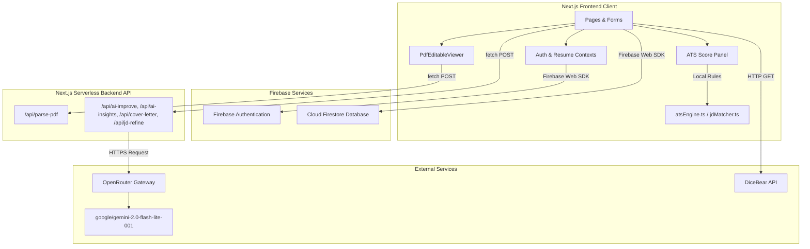

# HireLens AI – Project Discovery & Engineering Audit

This document presents a complete, citation-backed engineering audit of the existing **HireLens AI** codebase, performed as a prerequisite to the HireLens 2.0 product redesign. 

---

## 1. Executive Overview

*   **Purpose of the Project**: HireLens AI is an interactive, AI-driven SaaS platform designed to help job seekers build ATS-optimized resumes, score their current resumes against industry standards, match keywords with targeted Job Descriptions (JDs), and generate AI-driven cover letters.
*   **Current Maturity Level**: Late Prototype / MVP. Core user paths (login, document editor, preview, and history) are implemented, but significant security flaws, database casing inconsistencies, incomplete features, and a production build-blocking TypeScript error are present.
*   **Primary Business Goal**: Deliver high-fidelity, ATS-compliant application documents (resumes and cover letters) with immediate feedback loops, minimizing candidate rejection at automated screening filters.
*   **Intended Users**: Job seekers looking for a structured, AI-guided resume builder and analyzer.
*   **Current Development Status**: Development is active but blocked from production release. Next.js 16 (App Router) + React 19 is used, but a compilation error in the cover letter page causes production build failures (as detailed in `build_error.log`).
*   **Overall Architecture Summary**: Monolithic, client-centric architecture. The client application (Next.js App Router) directly calls Firebase Authentication for session management and queries Firestore for user data and history updates. The backend exists solely as serverless Next.js API routes (`app/api/*`) which act as proxy endpoints to make authorized OpenRouter AI completions requests.

---

## 2. Repository Structure

Below is the verified structural tree of the repository, followed by explanations of each major folder's responsibility:

```text
c:\Users\vishal\OneDrive\Desktop\Hirelens_ai\hire-lens-ai-resume-builder\
├── .agents/
├── docs/
│   └── docs/
│       ├── Sprint_01/
│       │   ├── Day_01.md
│       │   ├── Day_02.md
│       │   ├── Day_03.md
│       │   ├── Day_04.md
│       │   └── Day_05.md
│       ├── 00_Project_Vision.md
│       ├── 01_Master_Roadmap.md
│       ├── 02_Architecture.md
│       ├── 03_Coding_Standards.md
│       ├── 04_Project_Rules.md
│       ├── 05_Prompt_Library.md
│       ├── 06_API_Keys_and_Setup.md
│       ├── 07_Debugging_Guide.md
│       ├── 08_Testing_Guide.md
│       ├── 09_Deployment_Guide.md
│       ├── 10_CrewAI_Guide.md
│       ├── 11_React_Guide.md
│       ├── 12_FastAPI_Guide.md
│       ├── 13_Database_Guide.md
│       ├── 14_UI_UX_Guide.md
│       ├── 15_Git_Workflow.md
│       ├── 20_Decision_Log.md
│       ├── 21_Tech_Stack.md
│       ├── 22_Product_Requirements.md
│       ├── 23_Glossary.md
│       ├── 24_UI_Wireframes.md
│       ├── 25_Backlog.md
│       └── 26_Risks.md
├── frontend/
│   ├── app/
│   │   ├── api/
│   │   │   ├── ai-improve/
│   │   │   ├── ai-insights/
│   │   │   ├── cover-letter/
│   │   │   ├── jd-refine/
│   │   │   └── parse-pdf/
│   │   ├── dashboard/
│   │   │   ├── builder/
│   │   │   ├── cover-letter/
│   │   │   ├── history/
│   │   │   ├── job-matcher/
│   │   │   ├── resume-analyzer/
│   │   │   └── settings/
│   │   ├── login/
│   │   ├── signup/
│   │   ├── globals.css
│   │   ├── layout.tsx
│   │   └── page.tsx
│   ├── components/
│   │   ├── pdf/
│   │   │   └── PdfEditableViewer.tsx
│   │   ├── resume-builder/
│   │   │   ├── forms/
│   │   │   │   ├── AchievementsForm.tsx
│   │   │   │   ├── CertificationsForm.tsx
│   │   │   │   ├── EducationForm.tsx
│   │   │   │   ├── ExperienceForm.tsx
│   │   │   │   ├── PersonalInfoForm.tsx
│   │   │   │   ├── ProjectsForm.tsx
│   │   │   │   └── SkillsForm.tsx
│   │   │   ├── preview/
│   │   │   │   ├── templates/
│   │   │   │   │   ├── MinimalistTemplate.tsx
│   │   │   │   │   ├── ModernTemplate.tsx
│   │   │   │   │   └── ProfessionalTemplate.tsx
│   │   │   │   ├── ResumePreview.tsx
│   │   │   │   └── TemplateSwitcher.tsx
│   │   │   ├── AIImprovementModal.tsx
│   │   │   ├── ATSScorePanel.tsx
│   │   │   ├── JDMatcherPanel.tsx
│   │   │   └── ResumeEditor.tsx
│   │   ├── ui/
│   │   ├── Navbar.tsx
│   │   ├── ProtectedRoute.tsx
│   │   ├── Sidebar.tsx
│   │   ├── ThemeProvider.tsx
│   │   └── ThemeToggle.tsx
│   ├── contexts/
│   │   ├── AuthContext.tsx
│   │   └── ResumeContext.tsx
│   ├── lib/
│   │   ├── aiService.ts
│   │   ├── atsAnalyzer.ts
│   │   ├── atsEngine.ts
│   │   ├── atsOrder.ts
│   │   ├── coverLetterEngine.ts
│   │   ├── defaultResume.ts
│   │   ├── exportService.ts
│   │   ├── firebase.ts
│   │   ├── historyService.ts
│   │   ├── jdMatcher.ts
??  │   ├── profileService.ts
│   │   └── utils.ts
│   ├── public/
│   ├── types/
│   │   └── resume.ts
│   ├── package.json
│   ├── tsconfig.json
│   └── components.json
├── README.md
├── design.md
├── requirements.md
└── mcp_config.json
```

### Responsibility of Major Folders:
1.  **`docs/docs/`**: Holds developer guides and markdown documentation. It is structured as a development wiki but contains many speculative guides (e.g., `12_FastAPI_Guide.md` and `10_CrewAI_Guide.md`) containing placeholder structures that do not match the actual codebase.
2.  **`docs/docs/Sprint_01/`**: Contains daily sprint notes outlining the discovery process of the original developers.
3.  **`frontend/app/`**: Implements page routes (Auth pages, Dashboard views) and Next.js serverless API routes.
4.  **`frontend/app/api/`**: Serves as the application's backend API layer, routing data processing, file parsing, and OpenRouter AI optimization calls.
5.  **`frontend/components/`**: Houses all modular components, separated into reusable global layout blocks (Sidebar, Navbar), primitive inputs (`ui/`), custom editor forms (`resume-builder/forms/`), template renderers (`resume-builder/preview/`), and a custom client-side PDF renderer (`pdf/`).
6.  **`frontend/contexts/`**: Contains React Context state providers. `AuthContext.tsx` handles the user session listener, and `ResumeContext.tsx` handles structured resume state.
7.  **`frontend/lib/`**: Contains core business logic, including client API wrappers, database service layers (Auth, Firestore), and local parsing/evaluation rules.
8.  **`frontend/types/`**: Holds TypeScript schema contracts (`resume.ts`).

---

## 3. Technology Stack (Verified Only)

The following list contains **only** technologies directly verified inside the repository:

| Layer | Verified Technology | Verification Source |
|---|---|---|
| **Frontend Framework** | Next.js 16.1.6 + React 19.2.3 | `frontend/package.json` |
| **Backend Framework** | Next.js Serverless API Routes (Node.js runtime) | `frontend/app/api/` routes |
| **Programming Languages** | TypeScript, JavaScript | `.ts`, `.tsx`, `.js` source files |
| **Database** | Google Firebase Cloud Firestore | `frontend/lib/firebase.ts` |
| **Authentication** | Firebase Authentication | `frontend/lib/firebase.ts`, `frontend/contexts/AuthContext.tsx` |
| **State Management** | React Context (`AuthContext`, `ResumeContext`) | `frontend/contexts/` |
| **Styling** | Tailwind CSS v4.0.0 | `frontend/package.json`, `frontend/app/globals.css` |
| **UI Libraries** | Radix UI primitives + Lucide React icons | `frontend/package.json` |
| **Build Tools** | Next.js Compiler (Turbopack configured) | `frontend/package.json`, `build_error.log` |
| **Package Managers** | npm | `frontend/package-lock.json` |
| **Testing Frameworks** | Playwright (no unit test framework exists) | `frontend/test-jd-matcher.js` |
| **AI Models** | `google/gemini-2.0-flash-lite-001` (via OpenRouter) | `frontend/app/api/*/route.ts` |
| **External Integrations** | OpenRouter completions API, DiceBear SVG avatars | `frontend/app/api/*/route.ts`, `frontend/app/dashboard/settings/page.tsx` |
| **Deployment** | Vercel (recommended target) | `README.md` |
| **Containerization** | **Not Verified from Repository** (no Dockerfiles present) | - |
| **Version Control** | Git | `.git` workspace folder |
| **Documentation** | Markdown | `.md` files in root and `/docs` |

---

## 4. Frontend Analysis

### Pages
*   **Root Redirect (`app/page.tsx`)**: Mounts `useAuth` and redirects logged-in users to `/dashboard` and unauthenticated visitors to `/login`.
*   **Auth Pages (`app/login/page.tsx` & `app/signup/page.tsx`)**: Renders custom login/signup forms, backed by Zod schemas for layout validation.
*   **Dashboard Home (`app/dashboard/page.tsx`)**: Lists quick actions (Create Resume, Analyze, Generate Cover Letter) and displays empty-state recent activity.
*   **Resume Builder (`app/dashboard/builder/page.tsx`)**: Hosts `ResumeEditor.tsx` inside a full-height workspace.
*   **Resume Analyzer (`app/dashboard/resume-analyzer/page.tsx`)**: Handles PDF uploads, invokes the client-side parsing engine, displays rule scores, and triggers AI recommendation calls.
*   **Job Matcher (`app/dashboard/job-matcher/page.tsx`)**: Hosts `JDMatcherPanel.tsx` in a split layout to match resume text against target job descriptions.
*   **Cover Letter (`app/dashboard/cover-letter/page.tsx`)**: Triggers cover letter generation, tone updates, and A4 manual text tuning.
*   **Activity History (`app/dashboard/history/page.tsx`)**: Polls and presents activity logs from Firestore.
*   **Settings Page (`app/dashboard/settings/page.tsx`)**: Modifies username, selects DiceBear avatar seeds, configures default template theme, and manages account purge.

### Components
*   **`Sidebar.tsx`**: Collapsible vertical toolbar featuring transition animations.
*   **`Navbar.tsx`**: Header holding the dark/light mode toggle, user info, notification badge, and a profile dropdown.
*   **`PdfEditableViewer.tsx`**: Client-side text extractor using `pdfjs-dist` worker. Mounts a `contentEditable` editor overlay letting users edit raw parsed text directly inside the browser.
*   **`ResumeEditor.tsx`**: Orchestrates builder forms and preview templates.
*   **`TemplateSwitcher.tsx`**: Small button deck managing current active visual templates.

### Layouts & Routing
*   **Root Layout (`app/layout.tsx`)**: Initializes `ThemeProvider` and registers the root `sonner` toaster.
*   **Dashboard Layout (`app/dashboard/layout.tsx`)**: Wraps inner routes with `AuthProvider`, `ResumeProvider`, and nests components inside the `Sidebar` and `Navbar` framework.
*   **Routing**: Next.js App Router (filesystem-based).

### State Management
*   **`AuthContext.tsx`**: Tracks the user session via Firebase Auth `onAuthStateChanged`.
*   **`ResumeContext.tsx`**: Houses the global active resume state tree, exposing `resume`, `setResume`, and `updateResume` modifiers.

### Forms & Validation
*   **Auth Forms**: Handled via `react-hook-form` coupled with `zodResolver`.
    *   *Login Schema*: Email must be valid; password must be $\ge 6$ characters (`login/page.tsx#L17`).
    *   *Signup Schema*: Name is required; password must be $\ge 8$ characters, matching `confirmPassword` (`signup/page.tsx#L18-L26`).
*   **Resume Builder Forms**: Section updates are triggered via instant input change callbacks, bypassing submit-button constraints to allow live editing.

### Reusable Components & Libraries
*   **shadcn UI primitives**: Located in `components/ui/` (`button.tsx`, `card.tsx`, `dialog.tsx`, `input.tsx`, `label.tsx`).
*   **Icons**: Lucide icons (`lucide-react`).
*   **Animations**: Framer motion (`framer-motion`) handles page transitions, modals, and panel slides.
*   **Third-party libraries**: `docx` handles cover letter exports; `pdf-lib` constructs clean PDF binaries; `react-to-print` manages direct DOM A4 print actions.

### Architecture and Quality Rating
*   **Overall Frontend Architecture**: Client-heavy monolithic model. UI views bind data directly to React states or context models, bypassing separate API controllers.
*   **Visual Design / UX Quality**: **9/10**. Sleek layout styling, cohesive dark/light mode support, real A4 print layouts, visual overflow warning banners, and smooth animations.
*   **Code Quality**: **7/10**. Strong component separation, clean TypeScript interfaces, but has type casting bypasses (`as any`) to bypass compiler checks and duplicate parsing packages.

---

## 5. Backend Analysis

Because HireLens AI has no separate backend service, Next.js API Routes function as the backend layer.

### Folder Structure & Route Handlers
API routes are placed under `frontend/app/api/` with individual `route.ts` handlers:
*   **`/api/ai-improve/route.ts`**: Optimizes professional summary, experience, or project bullet points based on target rules.
*   **`/api/ai-insights/route.ts`**: Receives resume text, job description, and local score breakdowns to produce 3-5 career insights.
*   **`/api/cover-letter/route.ts`**: Creates or edits cover letters (shorten, polish, impact actions).
*   **`/api/jd-refine/route.ts`**: Examines keyword gaps between a resume and job description.
*   **`/api/parse-pdf/route.ts`**: Extracts text from files using the `pdf-parse` npm package.

### Services & Business Logic
Backend-side helpers are placed under `frontend/lib/`:
*   **`aiService.ts`**: Incorporates safety limits, enforcing a 2-second cooldown on API calls (`aiService.ts#L8`) and using `AbortController` to cancel stale duplicate queries.
*   **`atsAnalyzer.ts`**: Holds client-side deterministic scoring logic (A4 overflow checks, bullet checks, missing section checks).
*   **`atsEngine.ts`**: Contains parsing regexes detecting years of experience, credentials, passive verbs, and missing keywords.
*   **`jdMatcher.ts`**: Houses keyword frequency scoring.
*   **`profileService.ts`**: Handles Firestore operations (Profile loads, avatar uploads, and total account purges).
*   **`historyService.ts`**: Handles activity snapshots, calculating a 7-day TTL expiration date (`historyService.ts#L39`).

### Authentication & Authorization
*   **Critical Gaps Identified**: **No authentication checks exist inside Next.js API Routes.** Although routes are meant to be private, handlers (`/api/ai-improve`, `/api/ai-insights`, `/api/cover-letter`, `/api/jd-refine`, `/api/parse-pdf`) do not inspect session headers or verify Firebase Auth tokens. Anyone can send POST payloads to these routes, exploiting the backend to make unverified OpenRouter calls.

### CORS & Middleware
*   **CORS**: No cross-origin headers are configured. Next.js defaults apply (browsers block cross-origin requests by default, but local extensions/scripts bypass this).
*   **Middleware**: There is no server-side Next.js route middleware (`middleware.ts`) intercepting and checking request contexts.

### Backend Quality Rating
*   **Rating**: **5/10**. While the proxy services are simple, the complete lack of API endpoint security, absence of validation middleware, and direct client-to-database connections (which bypass backend layers) represent severe technical debt.

---

## 6. Database Analysis

*   **Identified Database**: Google Firebase Cloud Firestore (NoSQL Document Store).
*   **Connection Method**: Client-side initialization using the Firebase Web SDK (`lib/firebase.ts`).
*   **ORM/ODM**: None. Documents are accessed using standard SDK methods (`doc`, `getDoc`, `setDoc`, `deleteDoc`).
*   **Data Models & Collections**:
    *   **`users` Collection**: Stores profile configurations.
        *   *Schema (UserProfile)*: `fullName` (string), `defaultTemplate` (string), `themePreference` ("light" | "dark" | "system"), `avatarUrl` (string - base64 encoded image), `updatedAt` (Timestamp).
    *   **`users/{userId}/history` Subcollection**: Stores activity history snapshots.
        *   *Schema (ActivityHistoryItem)*: `id` (string), `type` ("resume" | "ats-analysis" | "job-match" | "cover-letter"), `title` (string), `metadata` (object), `contentSnapshot` (string), `structuredData` (any), `createdAt` (Timestamp), `expiresAt` (Timestamp).
*   **Indexes**: To bypass database composite index requirements, `getRecentHistory` queries only the `expiresAt` range (`expiresAt > now`) and sorts by it in Firestore, performing sorting by `createdAt` in-memory (`historyService.ts#L84-L88`).
*   **Migration Strategy**: *Not Verified from Repository.* (Firestore is schema-less; no migration history, schemas, or tools exist).
*   **Database Casing Bug**: `signup/page.tsx#L54` saves signup profiles to the **`"Users"`** collection (capital U), but `profileService.ts#L21` and history queries read from the **`"users"`** collection (lowercase u).
    *   *Result*: User profiles created during signup contain their name. When they navigate to the dashboard settings page, it fetches from `"users"`. Since that document does not exist, `getUserProfile` initializes a new default profile with name `"New User"` and writes it to `"users"`. The name entered during signup is completely orphaned and ignored.

---

## 7. AI Architecture

*   **Model Used**: `google/gemini-2.0-flash-lite-001` via OpenRouter proxy (`app/api/*/route.ts`).
*   **Prompt Storage**: Prompts are stored as template literal strings directly inside the API route handler files.
*   **Prompt Structure**:
    *   *Improve Section (`api/ai-improve/route.ts#L47-L57`)*: System prompt instructs the model to act as a resume optimizer. It enforces no markdown/explanations and prevents fabricating metrics.
    *   *Insights (`api/ai-insights/route.ts#L20-L33`)*: System prompt requests 3-5 concise, actionable bullet points explaining how to improve a candidate's ATS score, tone, and keyword alignment.
*   **Resume Parsing**: The platform performs parsing in two places:
    1.  *Client-Side*: `PdfEditableViewer.tsx#L31-L84` reads the PDF array buffer via `pdfjs`, extracts character coordinate arrays, sorts them by Y-descending then X-ascending to reconstruct logical reading order, and handles paragraph splits.
    2.  *Server-Side*: `/api/parse-pdf/route.ts` reads files using the `pdf-parse` library and returns raw text.
*   **Vector Search & Embeddings**: *Not Verified from Repository.* (No embedding or vector database is present in the code).

---

## 8. Environment Configuration

The application references the following environment variables:

| Variable Name | Purpose | Required / Optional | Where it is Used |
|---|---|---|---|
| **`OPENROUTER_API_KEY`** | Authorizes requests to the OpenRouter AI endpoints. | **Required** | Next.js API Routes (`app/api/*/route.ts`) |
| **`NEXT_PUBLIC_FIREBASE_API_KEY`** | Identifies the client configuration inside Firebase. | Optional (Defaults exist) | Listed in `.env.example`, but not used in code. |
| **`NEXT_PUBLIC_FIREBASE_AUTH_DOMAIN`** | Connects to Firebase Auth. | Optional (Defaults exist) | Listed in `.env.example`, but not used in code. |
| **`NEXT_PUBLIC_FIREBASE_PROJECT_ID`** | Connects to the project's Firestore database. | Optional (Defaults exist) | Listed in `.env.example`, but not used in code. |
| **`NEXT_PUBLIC_FIREBASE_STORAGE_BUCKET`**| Connects to Firebase Cloud Storage. | Optional (Defaults exist) | Listed in `.env.example`, but not used in code. |
| **`NEXT_PUBLIC_FIREBASE_MESSAGING_SENDER_ID`**| Identifies the messaging configuration. | Optional (Defaults exist) | Listed in `.env.example`, but not used in code. |
| **`NEXT_PUBLIC_FIREBASE_APP_ID`** | Identifies the app instance. | Optional (Defaults exist) | Listed in `.env.example`, but not used in code. |

> [!WARNING]
> **Firebase configuration variables are hardcoded in `lib/firebase.ts#L7-L15`**. The environment configuration parameters in `.env` are completely ignored by the code, exposing API credentials in frontend javascript bundles.

---

## 9. External Integrations

*   **OpenRouter API**: Acts as the LLM gateway (`https://openrouter.ai/api/v1/chat/completions`) for text improvement, cover letter generation, and keyword matching.
*   **Firebase SDK**: Manages authentication and Firestore updates.
*   **DiceBear API**: Generates SVG avatars dynamically (`https://api.dicebear.com/9.x/...`) on the settings page.
*   **Unpkg CDN**: Hosts the client-side Web Worker script for `pdfjs-dist` text extraction.

---

## 10. Feature Inventory

The following table lists every feature implemented in the repository, along with its current status:

| Module | Feature Name | Current Status | Code Verification / Details |
|---|---|---|---|
| **Auth** | User Signup | **Working** | `app/signup/page.tsx` (has casing database write mismatch). |
| **Auth** | User Login | **Working** | `app/login/page.tsx` |
| **Auth** | Auth Redirects | **Working** | `app/page.tsx`, `components/ProtectedRoute.tsx` |
| **Builder** | Live Forms | **Working** | `components/resume-builder/forms/` |
| **Builder** | Live PDF Preview | **Working** | `components/resume-builder/preview/ResumePreview.tsx` |
| **Builder** | Template Switching | **Working** | Modern, Minimalist, Professional switch options (`preview/templates/`). |
| **Builder** | PDF Download | **Working** | Invokes client-side print dialog using `react-to-print`. |
| **Builder** | Word Export | **Incomplete** | `lib/exportService.ts#L7-L11` triggers a mock alert: *"Word (.docx) export is under development"*. |
| **Builder** | AI Improve | **Working** | Sends text selections to `/api/ai-improve`. |
| **Builder** | A4 Overflow Alert | **Working** | `ResumeEditor.tsx#L61-L76` displays a visual warning if preview height $>1128\text{px}$. |
| **Analyzer** | PDF Text Extraction | **Working** | Parses coordinates client-side (`PdfEditableViewer.tsx`). |
| **Analyzer** | Quality Scoring | **Working** | Calculates score (35-95) using rules in `atsEngine.ts#L97`. |
| **Analyzer** | AI Score Insights | **Working** | Calls `/api/ai-insights` to get optimization bullets. |
| **Analyzer** | PDF Editor Overlay | **Working** | Renders parsed text inside a `contentEditable` div for manual fixes. |
| **Matcher** | Resume/JD Keywords | **Working** | Extracts unique keywords, highlighting matched and missing lists (`lib/jdMatcher.ts`). |
| **Matcher** | Deep AI Insights | **Broken** | **`JDMatcherPanel.tsx#L470` is empty.** The component retrieves AI insights from `/api/jd-refine` but does not render them inside the empty `prose` container. |
| **Cover Letter**| Tailored Generation | **Working** | Reads resume text + JD context to generate letters via `/api/cover-letter`. |
| **Cover Letter**| Tone Selection | **Working** | Pass custom tone string (e.g., Professional, Enthusiastic) to LLM prompt. |
| **Cover Letter**| Rich Text Editor | **Working** | Mounts generated text inside an A4-styled `contentEditable` div. |
| **Cover Letter**| AI Refining | **Working** | Triggers Polish, Shorten, and Impact options. |
| **Cover Letter**| PDF & Word Export | **Working** | Word export works via `docx` library; PDF export works via custom `pdf-lib` wrapping. |
| **History** | Snapshot saving | **Working** | Automatically pushes snapshot logs to Firestore with a 7-day TTL (`lib/historyService.ts`). |
| **Settings** | Profile Settings | **Working** | Updates display names and theme/template preferences. |
| **Settings** | Avatar Collection | **Working** | Converts DiceBear selection to Base64 strings. |
| **Settings** | Account Purge | **Working** | Purges Firestore history, user documents, and Auth profiles. |

---

## 11. Dependency Graph

### Written Explanation
The application is a client-centric monolith. The **Frontend Client** (Next.js components) manages all user actions and routes. When a user interacts with the system:
1.  **Auth Operations**: Components call the client-side **Firebase Auth SDK** directly to verify sessions.
2.  **Database Operations**: Components query the **Firebase Firestore SDK** directly to load/save user profiles, themes, default templates, and activity history snapshots.
3.  **Local Analysis Operations**: Calculations (Resume ATS Quality and JD Keyword parsing) run client-side inside **ATS/JD Engines** using local rules.
4.  **AI/Parsing Operations**: Tasks that require credentials or server utilities are routed to the **Next.js API Layer** (endpoints).
5.  **API proxies**: The API Layer parses PDFs using `pdf-parse` or forwards user inputs to **OpenRouter**, which queries the **Gemini 2.0 Flash Lite** LLM using the developer's server-side key.

### Dependency Graph (Mermaid)



---

## 12. Data Flow Analysis

This section outlines how data travels through the system's key operations:

### Resume Upload, Client-side Text Extraction, and Verification
1.  The user uploads a PDF resume in the **Resume Analyzer** page.
2.  `ResumeAnalyzerPage` registers the file in state and mounts `PdfEditableViewer`.
3.  `PdfEditableViewer` reads the file buffer and loads it into **pdfjs-dist** inside the browser.
4.  The client parsing loop extracts text coordinates, sorts them by coordinates, cleans multiple spaces, and returns structured text.
5.  The parsed text is bound to the `contentEditable` editor canvas, letting the user verify and update it.

### Baseline ATS Quality Scoring & Flag Analysis
1.  When text is loaded or updated in the PDF Editor, `handleTextUpdate` immediately triggers `analyzeResumeQuality`.
2.  `analyzeResumeQuality` scans the raw string using rule regexes:
    *   *Word count check*: Subtracts 30 points if character count $<500$.
    *   *Bullet check*: Subtracts 20 points if no bullets (`•`, `-`, `*`) are present.
    *   *Weak verbs*: Deducts 10 points per occurrence of passive verbs (e.g., "helped", "handled").
    *   *Quantification*: Caps impact score at 20 if no numbers/percentages are found.
3.  The resulting score and warning flags are returned to state and rendered in the score breakdown charts.

### Job Description Keyword Matching
1.  The user selects the **Match With Job** tab in the Analyzer, pokes the **Job Matcher**, and pastes a target job description.
2.  The matching engine extracts keywords from the JD, filters out stop words, and keeps unique terms.
3.  The resume text is parsed for matching keywords, calculating an alignment score:
$$\text{Alignment Score} = \left( \frac{\text{Matched Keywords}}{\text{Total JD Keywords}} \right) \times 100$$
4.  In the background, matched keywords are sequentially mapped to mock section metrics (Skills, Experience, Projects) to populate charts.

### AI Cover Letter Generation
1.  The user pastes a Job Description and clicks **Generate Cover Letter** (`app/dashboard/cover-letter/page.tsx`).
2.  The client triggers `generateCoverLetter` in `lib/coverLetterEngine.ts`, sending the resume text, JD, tone, and company details to `/api/cover-letter`.
3.  The API route retrieves the server-side OpenRouter key, builds a prompt, and queries Gemini 2.0.
4.  Gemini returns the cover letter text, which is loaded into the client's editor canvas.

---

## 13. API Inventory

The following table documents every API endpoint in the system:

| Method | Route | Purpose | Auth Required | Related Service / Logic | Current Status |
|---|---|---|---|---|---|
| **POST** | `/api/ai-improve` | Rewrites a resume section (summary, experience, projects) to optimize clarity and metrics. | **No** (Vulnerable) | `route.ts#L5`, OpenRouter API | **Working** |
| **POST** | `/api/ai-insights` | Generates 3-5 custom resume improvement recommendations based on ATS breakdowns. | **No** (Vulnerable) | `route.ts#L5`, OpenRouter API | **Working** |
| **POST** | `/api/cover-letter` | Generates or refines cover letters (Polish, Shorten, Make Impactful actions). | **No** (Vulnerable) | `route.ts#L5`, OpenRouter API | **Working** |
| **POST** | `/api/jd-refine` | Examines keyword alignment between a resume and job description. | **No** (Vulnerable) | `route.ts#L5`, OpenRouter API | **Working** |
| **POST** | `/api/parse-pdf` | Uploads and extracts text from PDF files using `pdf-parse` (npm). | **No** (Vulnerable) | `route.ts#L4`, node `pdf-parse` | **Working** |

---

## 14. Security Review

*   **Authentication & Authorization**:
    *   *Frontend*: `ProtectedRoute` redirects unauthenticated users to `/login`.
    *   *Backend API Routes*: **Completely unauthenticated.** There are no token checks inside any `/api/*` handlers, exposing the serverless function endpoints to unauthorized billing exploitation.
*   **Secrets Exposure**:
    *   *Backend API Key*: The `OPENROUTER_API_KEY` is stored on the server (`process.env.OPENROUTER_API_KEY`), which is secure.
    *   *Firebase API Credentials*: **Hardcoded in `lib/firebase.ts#L7-L15`.** These values are exposed in client-side production bundles.
*   **File Upload Validation**:
    *   `/api/parse-pdf` restricts files to `application/pdf` and limits file size to $5\text{MB}$ (`parse-pdf/route.ts#L16-L29`).
    *   However, because the endpoint is public, it remains vulnerable to Denial of Service (DoS) attacks and buffer overflow attempts.
*   **Input Sanitization**:
    *   The application does not perform input sanitization. Prompt inputs are injected directly into LLM prompts, making them vulnerable to prompt injection attacks.
*   **Database Security Rules**:
    *   The Firestore rules listed in `README.md#L99-L114` enforce user-level document ownership.
    *   However, due to the `"Users"`/`"users"` casing mismatch bug, the signup page writes to `"Users"`, which is **completely unprotected** by the database rules.

---

## 15. Performance Review

*   **Component Size & Complexity**:
    *   `JDMatcherPanel.tsx` is large ($27\text{KB}$) and mixes state management, PDF parsing integration, API requests, and display charts.
*   **Duplicate Parsing Libraries**:
    *   The project installs and imports **two separate PDF parsing engines**: `pdfjs-dist` (used client-side in `PdfEditableViewer.tsx`) and `pdf-parse` (used server-side in `/api/parse-pdf/route.ts`).
*   **Unnecessary Context Re-renders**:
    *   `ResumeContext.tsx` does not memoize the state values passed to the `ResumeContext.Provider`. Any update to a resume field triggers a complete re-render of all builder inputs.
*   **Base64 Avatar Payload Risks**:
    *   The avatar upload function (`profileService.ts#L65-L122`) compresses images and converts them to base64, saving them directly inside the user's profile document in Firestore.
    *   While this avoids Cloud Storage limits, large base64 strings inflate document sizes, increasing bandwidth usage and risking hitting Firestore's $1\text{MB}$ document limit.

---

## 16. Code Quality Review

*   **TypeScript and Compilation Errors**:
    *   The production build currently fails due to a TypeScript error in `app/dashboard/cover-letter/page.tsx:171`. The `pdfBytes` array cannot be assigned to type `BlobPart`.
    *   To bypass compilation warnings, the code uses `as any` casting in `cover-letter/page.tsx#L204` and `PdfEditableViewer.tsx#L131`, masking type safety issues.
*   **Dead Code & Placeholders**:
    *   `lib/exportService.ts` contains a placeholder for Word exports that simply alerts the user.
    *   `lib/atsOrder.ts` is a $239\text{-byte}$ helper that is imported but never used.
*   **Broken Navigation Links**:
    *   The profile dropdown links to `href="#profile"` (`Navbar.tsx#L120`) instead of routing to `/dashboard/settings`.
    *   The login page has a broken link pointing to `/forgot-password` (`login/page.tsx#L122`).

---

## 17. Project Health Score

| Category | Score | Primary Reason for Score |
|---|---|---|
| **Architecture** | **6 / 10** | Monolithic client-centric design works, but lacking server-side route authentication. |
| **Frontend** | **8 / 10** | Premium layout, custom editors, A4 visual warnings, but type safety is bypassed. |
| **Backend** | **5 / 10** | No endpoint validation, lack of auth verification, and no middleware checking. |
| **Database** | **5 / 10** | Case-sensitivity bug in collections (`"Users"` vs `"users"`) breaks profiles. |
| **AI Integration** | **8 / 10** | OpenRouter provides fast, cheap inference, but prompts are hardcoded. |
| **Security** | **4 / 10** | Hardcoded Firebase keys, unauthenticated API routes, and unprotected signup tables. |
| **Performance** | **7 / 10** | Fast local parsing engines, but context updates cause full-canvas re-renders. |
| **Maintainability** | **6 / 10** | Multiple lint errors, stale test setups, and type-checking issues. |
| **Scalability** | **6 / 10** | Serverless functions scale well, but base64 avatar storage in Firestore limits profiles. |
| **Documentation** | **8 / 10** | Day-by-day logs are detailed, but guide templates are empty placeholders. |
| **Code Quality** | **7 / 10** | Structured TS type definitions, but masking compiler issues with `as any`. |
| **UI / UX** | **8 / 10** | Great theme design, clean layouts, but contains broken links and empty containers. |
| **Developer Experience**| **6 / 10** | Clean folder setups, but build failures make local deployment tedious. |
| **Testing** | **4 / 10** | Script for Playwright exists, but unit testing frameworks are not configured. |
| **Deployment Readiness**| **4 / 10** | Production build fails due to a TypeScript error in the cover letter page. |

---

## 18. Strengths

1.  **Deterministic Client-Side Scoring**: Evaluates documents instantly without incurring API charges or server latency (`atsAnalyzer.ts`).
2.  **Live Dual-Paned Workspace**: Provides a highly responsive split screen with live layout updates.
3.  **Strict Page-Overflow Detection**: Restricts resume layouts to a single page, showing alerts if content overflows (`ResumeEditor.tsx#L61`).
4.  **Instant Template Switcher**: Switches templates instantly using state changes without requiring database updates.
5.  **Client-Side PDF Text Extraction**: Uses Web Workers (`PdfEditableViewer.tsx`) to extract text locally, reducing server load.
6.  **Interactive PDF Editor**: Renders parsed text inside a `contentEditable` container, letting users edit extracted text directly.
7.  **Auto-Expiring History Logs**: Uses Firestore timestamps (`historyService.ts#L49`) to auto-expire logs after 7 days, saving storage.
8.  **Post-Generation AI Refining**: Refines cover letters (Polish, Shorten, Make Impactful) in place.
9.  **Solid Client-Side Validation**: Integrates Zod schema validation to verify credentials on auth pages.
10. **Clean Tailwind Variables**: Implements Tailwind CSS v4 variables (`globals.css`) for dark and light modes.

---

## 19. Weaknesses

1.  **Production Build Failure**: The Next.js production build fails due to a type check error in `cover-letter/page.tsx:171`.
2.  **Unsecured Backend API Endpoints**: Private AI endpoints do not authenticate requests, leaving them vulnerable to API abuse.
3.  **Case-Sensitivity Mismatch Bug**: The signup page writes to `"Users"`, while settings queries read from `"users"`, breaking profile name synchronization.
4.  **Broken Job Matcher AI Insights**: The `prose` container in `JDMatcherPanel.tsx#L470` is empty, hiding job matching insights from users.
5.  **Hardcoded Firebase Credentials**: Exposes API configurations inside client bundles instead of reading them from the environment.
6.  **Incomplete Word Export**: The resume builder Word export button simply displays a placeholder alert.
7.  **Broken Profile Settings Redirection**: The Navbar settings option links to `#profile` instead of routing to the settings page.
8.  **Duplicate PDF Extraction Packages**: Installs both `pdf-parse` (server-side) and `pdfjs-dist` (client-side), increasing bundle sizes.
9.  **Base64 Avatar Storage inside Firestore**: Uploads base64 strings directly to Firestore, risking hitting document size limits.
10. **Bypassed TypeScript Compilation Rules**: Uses `as any` type casting to mask compilation errors instead of resolving underlying types.

---

## 20. Missing Features

*   **Resume Builder Word (.docx) Export**: No export logic exists in `lib/exportService.ts`.
*   **Forgot Password Page**: The login page links to `/forgot-password`, but the route does not exist.
*   **API Authentication Layer**: The serverless endpoints lack token validation.
*   **Unit Tests**: The project has no unit test configurations (Jest/Vitest).
*   **Health and Diagnostic Endpoints**: The backend has no health check APIs.

---

## 21. Technical Debt

*   **Critical Severity**:
    *   *Next.js Build Failure*: Type error in `cover-letter/page.tsx:171` prevents building the project.
    *   *Casing Bug in Firestore Database*: The mismatch between `"Users"` and `"users"` collections breaks user profile loading.
*   **High Severity**:
    *   *Unauthenticated API Routes*: API endpoints are unsecured, exposing OpenRouter integrations to potential billing abuse.
    *   *Empty Insights Box*: The Job Matcher insights container is empty, hiding LLM suggestions.
*   **Medium Severity**:
    *   *Placeholder Word Export*: The resume builder Word export is unimplemented.
    *   *Hardcoded Firebase Keys*: Firebase API keys are hardcoded in `lib/firebase.ts`.
*   **Low Severity**:
    *   *Stale Build Logs and Errors*: Unused diagnostic files (`tsc_output.txt`, `build_error.log`) clutter the project root.
    *   *Broken Dropdown Link*: Navbar links to `#profile` instead of `/dashboard/settings`.

---

## 22. Recommendations

### Critical Priority (Do Today)
*   **Fix the compilation type mismatch**: Cast the `pdfBytes` array returned by `pdfDoc.save()` properly before instantiating the Blob (`cover-letter/page.tsx:171`), resolving the Next.js build block.
*   **Resolve database collection casing**: Update `signup/page.tsx#L54` to write profiles to the lowercase `"users"` collection, fixing the user profile loading bug.

### High Priority
*   **Secure serverless API routes**: Add authentication checks inside `/api/*` routes. Pass the user's ID token in requests and verify it using the Firebase Admin SDK on the backend.
*   **Fix the Job Matcher insights display**: Update `JDMatcherPanel.tsx#L470` to render the `{aiInsights}` variable inside the `prose` container.

### Medium Priority
*   **Implement Word (.docx) Export**: Implement the Word export logic in `lib/exportService.ts` using the `docx` library.
*   **Move Firebase configuration to environment variables**: Replace the hardcoded Firebase API credentials in `lib/firebase.ts` with environment variables.

### Low Priority & Quick Wins
*   **Fix the profile settings link**: Update the profile option in `Navbar.tsx#L120` to link to `/dashboard/settings`.
*   **Remove unused files**: Delete stale logs and diagnostic files (`tsc_output.txt`, `build_error.log`, `ts_errors.txt`) to clean up the project directory.

---

## 23. Executive Summary

### Current Project Maturity
The project is in a functional prototype stage. Core layouts, templates, editors, and deterministic scoring features are mature and high quality, but critical deployment, security, and database bugs block production release.

### Readiness for HireLens 2.0
The codebase is **not yet ready** for HireLens 2.0 development. Initiating a redesign or adding new features before resolving the build failures and security gaps would compound the technical debt.

### Major Blockers
*   A TypeScript compilation error prevents Next.js production builds.
*   A database casing mismatch between `"Users"` and `"users"` collections breaks profile loading.

### Most Valuable Existing Modules
*   **`atsEngine.ts` & `atsAnalyzer.ts`**: The rule scoring rules are highly detailed and execute completely on the client side, saving LLM tokens.
*   **Preview Template rendering engine**: The templates produce high-fidelity layout previews and print setups.

### Modules that should NEVER be rewritten
*   The interactive, dual-pane builder forms and their responsive preview alignments should be preserved as-is.

### Modules that should be Refactored
*   **Database access layer**: All Firestore queries must be protected. Sensitive updates should be routed through verified backend API endpoints instead of executing directly on the client.
*   **Profile assets service**: Avatar files should be uploaded to Firebase Cloud Storage rather than serializing base64 strings directly in Firestore user profiles.

### Estimated Engineering Effort
*   *Sprint 1 (Fixing critical bugs & route verification)*: 1 Engineer $\times$ 5 Days.
*   *Sprint 2 (API route authentication & Firestore migration)*: 1 Engineer $\times$ 5 Days.
*   *Redesign Initiation (HireLens 2.0)*: Ready to begin after Day 10.

### Recommended Sprint Priorities
1.  Fix compilation types and update the signup page collection reference.
2.  Enable Firebase Admin token verification on all Next.js API routes.
3.  Inject the `{aiInsights}` string into the Job Matcher container.
4.  Implement resume Word exports and update broken dropdown settings links.

### Overall Recommendation
Perform the critical and high-priority refactoring and security tasks during Sprints 1 and 2 to establish a robust, secure baseline. Once compile blocks and database casing issues are resolved, proceed with the architectural cleanup and UI overhaul of HireLens 2.0.
